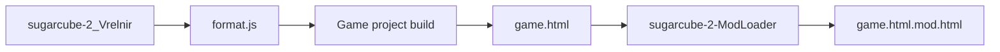

# CI/CD Build Pipeline

The ModLoader ecosystem uses GitHub Actions for builds and releases. Artifacts can be downloaded directly without local builds.

## Related Repositories

| Repository | Description |
|------------|-------------|
| [sugarcube-2_Vrelnir](https://github.com/Lyoko-Jeremie/sugarcube-2_Vrelnir) | Modified SC2 engine with ModLoader bootstrap |
| [sugarcube-2-ModLoader](https://github.com/Lyoko-Jeremie/sugarcube-2-ModLoader) | ModLoader core and Insert Tools |
| [DoLModLoaderBuild](https://github.com/Lyoko-Jeremie/DoLModLoaderBuild) | DoL build with ModLoader and built-in Mods |

## Modified SC2 Engine

- **Actions**: [sugarcube-2_Vrelnir/actions](https://github.com/Lyoko-Jeremie/sugarcube-2_Vrelnir/actions)
- **Artifacts**: `format.js` (ModLoader bootstrap, Wikifier changes, img/svg interception)
- **Use**: Override `devTools/tweego/storyFormats/sugarcube-2/format.js` in the game project, or use sc2ReplaceTool on compiled HTML

## ModLoader and Tools

- **Actions**: [sugarcube-2-ModLoader/actions](https://github.com/Lyoko-Jeremie/sugarcube-2-ModLoader/actions)
- **Artifacts**:
  - `BeforeSC2.js` — ModLoader core
  - `insert2html.js` — HTML injection tool
  - `packModZip.js` — Mod packaging tool
  - `sc2ReplaceTool.js` — SC2 replacement tool
  - Pre-built Mod zips (from submodules in modList.json)
- **Use**: Inject ModLoader into game HTML, or package Mods

## DoL Automated Build

- **Actions**: [DoLModLoaderBuild/actions](https://github.com/Lyoko-Jeremie/DoLModLoaderBuild/actions)
- **Releases**: [DoLModLoaderBuild/releases](https://github.com/Lyoko-Jeremie/DoLModLoaderBuild/releases)
- **Artifacts**: Full DoL game HTML with ModLoader and Mods from modList.json
- **Use**: End-user download for play, or base for bundles

## Build Order

Building the full game from scratch:

DoLModLoaderBuild usually automates this and publishes to Releases.
