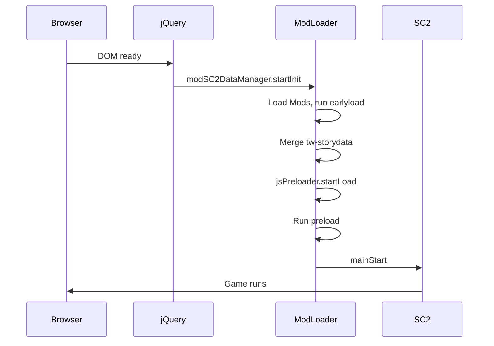
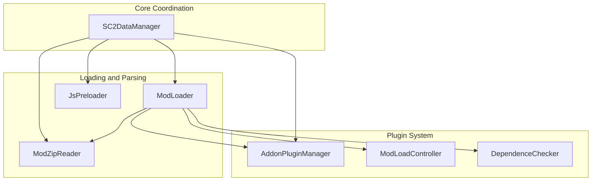
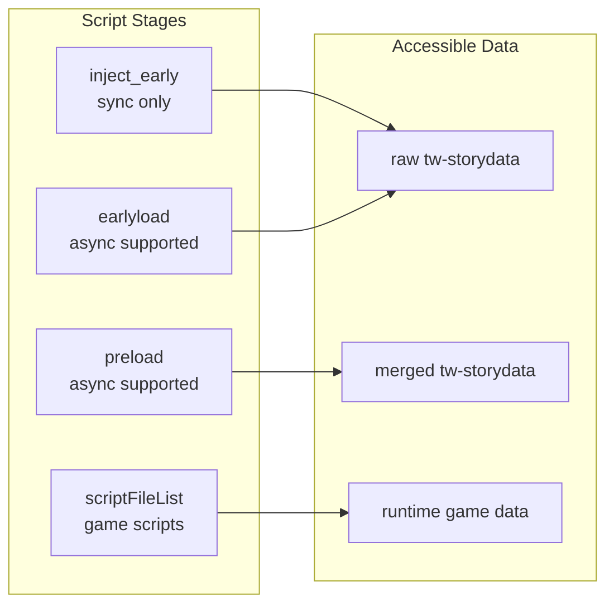

# System Architecture

## Startup Sequence

ModLoader changes the original `jQuery -> SC2` startup to `jQuery -> ModLoader -> SC2`:


Sequence:



## How ModLoader Hooks Into SugarCube2

SugarCube2 is a **fully synchronous** engine that turns game scripts (twee, JS, CSS) into HTML and displays them. Game scripts live in the compiled HTML's `tw-storydata` node.

SugarCube2 startup lives inside a `jQuery(() => {})` closure in `sugarcube.js`. ModLoader wraps the original code in a `mainStart()` function and inserts an async wait so ModLoader can finish loading and injecting Mods before the engine starts.

### SC2 Injection Point

ModLoader's injection point is in [sugarcube.js](https://github.com/Lyoko-Jeremie/sugarcube-2_Vrelnir/blob/TS/src/sugarcube.js):

```js
jQuery(() => {
  'use strict';

  const mainStart = () => {
    // Original contents of jQuery(() => {})
  };

  if (typeof window.modSC2DataManager !== 'undefined') {
    window.modSC2DataManager.startInit()
      .then(() => window.jsPreloader.startLoad())
      .then(() => mainStart())
      .catch(err => {
        console.error(err);
      });
  } else {
    mainStart();
  }
});
```

Startup changes from `jQuery -> SC2` to:

```
jQuery -> ModLoader -> SC2
```

The whole Mod load process (fetching zips, running early scripts, merging `tw-storydata`) finishes before SugarCube2 reads any game data.

## Core Component Relationships



## Script Stages and Data Availability

What each script stage can access:



## Global Objects

ModLoader exposes three global objects to Mod scripts:

| Global Object | Type | Purpose |
|---------------|------|---------|
| `window.modSC2DataManager` | SC2DataManager | Core coordinator, owns all subsystems |
| `window.modUtils` | ModUtils | Public API for Mod authors |
| `window.jsPreloader` | JsPreloader | Runs preload scripts after merge |

## Core Components

### SC2DataManager

Central manager that initializes internal objects and plugins. On `startInit()` it:

1. Caches the original unmodified `tw-storydata` via `initSC2DataInfoCache()`
2. Initializes internal components (ModLoader, ModZipReader, JsPreloader, etc.)
3. Starts Mod loading

### ModLoader

Core loader: reads Mod zip files from sources, runs scripts, registers Addons, merges Mod data into the game.

### ModZipReader

Reads Mod zip archives and parses `boot.json` to understand Mod structure and requirements.

### JsPreloader

Runs `scriptFileList_earlyload` and `scriptFileList_preload`. It wraps JS as `(async () => { return ${jsCode} })()` and awaits the result.

:::warning
`JsPreloader.JsRunner()` injects `return` before the first line, so only the first line or an IIFE from the first line runs.
:::

### AddonPluginManager

Manages Addon registration and dispatch. Addon Mods register via `registerAddonPlugin()` during EarlyLoad; regular Mods declare dependencies in `boot.json` via the `addonPlugin` field.

### DependenceChecker

Runs dependency checks during Mod load, validating that `dependenceInfo` constraints in `boot.json` are satisfied.

### SC2DataInfo and SC2DataInfoCache

ModLoader caches the original unmodified `tw-storydata` via `initSC2DataInfoCache()` at startup. Each `SC2DataInfo` exposes a read-only interface to game data.

**Purpose**:
- In earlyload and preload, Mod scripts can read raw or merged Passage/CSS/JS data
- Earlyload sees raw data; preload sees merged data
- Enables TweeReplacer, ReplacePatch, and similar Addons

## Overall Structure

ModLoader + game relation:

```
((SC2 engine + game)[Game] + (ModLoader + Mods)[Mod framework])
```

Mod framework breakdown:

```
(
  (
    ModLoader +
    (
      ModLoaderGui[Mod manager UI] +
      Addon[Extension plugins]
    )[Built-in Mods]
  )[Injected into HTML] + Other Mods[uploaded or remote]
)
```

### Packaged Structure

```
((Custom SC2 engine + original game) + ModLoader)
```

Build steps:
1. Build the modified SC2 engine to get `format.js`
2. Override `devTools/tweego/storyFormats/sugarcube-2/format.js` with `format.js`, then compile the game
3. Use `insert2html.js` to inject ModLoader into the game HTML

## Custom SugarCube2 Modifications

ModLoader requires a modified SC2 engine ([repository](https://github.com/Lyoko-Jeremie/sugarcube-2_Vrelnir)). Main changes:

1. **Startup change**: Insert ModLoader’s async wait inside the jQuery closure
2. **Wikifier changes**: Add `_lastPassageQ` and related data to track compilation; see `macrolib.js`, `parserlib.js`, `wikifier.js` (search for `passageObj`)
3. **Image tag interception**: Intercept `img` and `svg` creation so all images can be loaded from memory (no server)
