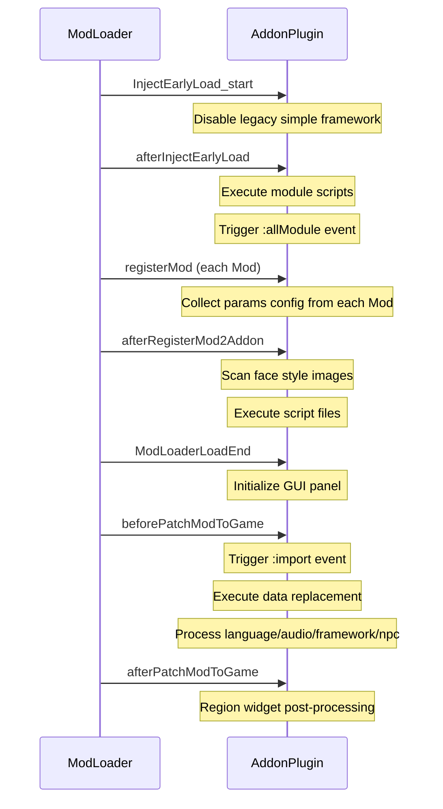

# AddonPlugin System

AddonPlugin is the core module that integrates maplebirchFramework with the ModLoader lifecycle. It is responsible for receiving registration requests from other mods, handling script loading, language file import, audio import, NPC configuration, and framework configuration.

## Registration Mechanism

The framework registers itself with ModLoader during the `inject_early` phase:

```js
modAddonPluginManager.registerAddonPlugin("maplebirch", "maplebirchAddon", this);
modSC2DataManager.getModLoadController().addLifeTimeCircleHook("maplebirchFramework", this);
```

Other mods register with the framework via the `addonPlugin` field in `boot.json`:

```json
{
  "addonPlugin": [
    {
      "modName": "maplebirch",
      "addonName": "maplebirchAddon",
      "modVersion": "^3.1.0",
      "params": {
        "script": ["mymod.js"],
        "language": true,
        "audio": true,
        "npc": { ... },
        "framework": { ... }
      }
    }
  ]
}
```

## Lifecycle Hooks

AddonPlugin implements ModLoader's `LifeTimeCircleHook` interface and executes in the following order:



## params Configuration Reference

### script

List of JavaScript script files, executed during the `afterRegisterMod2Addon` phase. This is the most commonly used configuration item.

```json
{
  "params": {
    "script": ["framework.js", "events.js"]
  }
}
```

Scripts can be disabled via the GUI panel. The script key format is `[ModName]:filePath`.

### module

Script files executed during the `afterInjectEarlyLoad` phase, earlier than `script`. Suitable for scenarios requiring custom module registration.

```json
{
  "params": {
    "module": ["early-init.js"]
  }
}
```

:::warning
`module` scripts run very early when the framework may not yet be fully initialized. Not recommended unless necessary.
:::

### language

Language file configuration, supporting three formats:

**Auto-import all languages:**

```json
{ "language": true }
```

Automatically searches and imports JSON/YAML translation files from the `translations/` directory.

**Specify language list:**

```json
{ "language": ["CN", "EN"] }
```

Imports `translations/cn.json` and `translations/en.json`.

**Custom path:**

```json
{
  "language": {
    "CN": { "file": "i18n/chinese.json" },
    "EN": { "file": "i18n/english.yml" }
  }
}
```

Translation file format is simple key-value pairs:

```json
{
  "greeting": "你好",
  "farewell": "再见"
}
```

### audio

Audio file configuration.

**Default path import:**

```json
{ "audio": true }
```

Import all audio files (mp3, wav, ogg, m4a, flac, webm) from the `audio/` directory.

**Custom path:**

```json
{ "audio": ["sounds/bgm", "sounds/sfx"] }
```

### npc

NPC configuration object with the following sub-items:

```json
{
  "npc": {
    "NamedNPC": [[{ "nam": "MyNPC", "gender": "f" }, { "love": { "maxValue": 100 } }, {}]],
    "Stats": { "customStat": { "maxValue": 100 } },
    "Sidebar": {
      "clothes": ["npc/clothes.json"],
      "image": ["img/npc/"],
      "config": ["npc/config.json"]
    }
  }
}
```

Each `NamedNPC` entry is a triple `[NPCData, NPCConfig, Translations]`. See [Named NPC System](./named-npc) for details.

### framework

Framework-level configuration, supporting trait registration and region widget addition.

**Register traits:**

```json
{
  "framework": {
    "traits": [
      {
        "title": "勇敢",
        "name": "brave",
        "colour": "green",
        "has": "V.brave >= 1",
        "text": "角色展现出勇气"
      }
    ]
  }
}
```

**Add region widget:**

```json
{
  "framework": {
    "addto": "sidebar",
    "widget": "<<myWidget>>"
  }
}
```

Conditional widget configuration is also supported:

```json
{
  "framework": {
    "addto": "sidebar",
    "widget": {
      "widget": "<<myWidget>>",
      "exclude": ["Combat"],
      "match": ["Home"],
      "passage": "MyPassage"
    }
  }
}
```

## Data Replacement

During the `beforePatchModToGame` phase, AddonPlugin performs the following game data modifications:

- Modify date format options (Options Overlay)
- Modify weather JavaScript (WeatherManager)
- Modify PC model (Character)
- Modify face styles (Character)
- Modify transformation effects (Transformation)

These modifications use the `replace()` utility function to replace Passage and script content via regular expressions.
