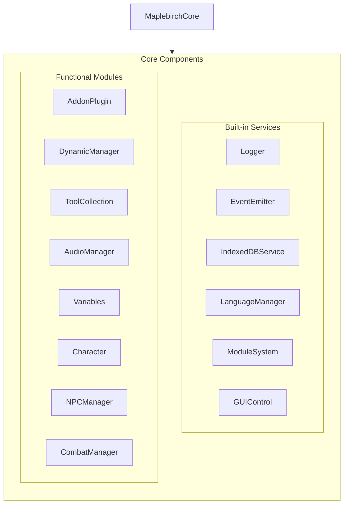
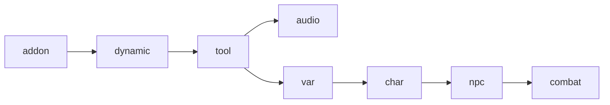
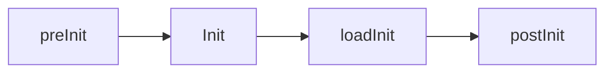
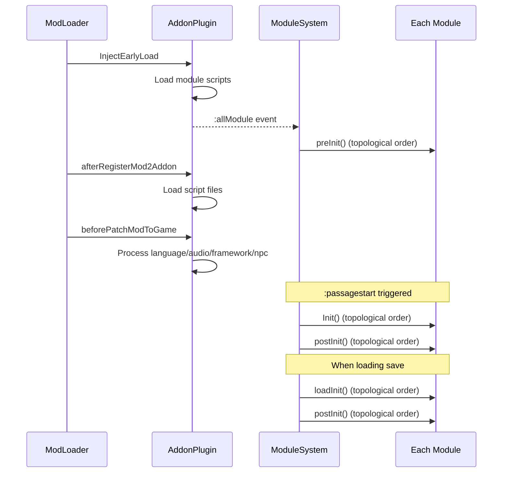

# Core Architecture

This document introduces the internal architecture of maplebirchFramework, including the core class structure, module system, and initialization flow.

## MaplebirchCore

`MaplebirchCore` is the central object of the framework, exposed as a singleton via `window.maplebirch`. It instantiates 6 built-in services during construction and registers 8 functional modules through `ModuleSystem`.



### Service Initialization Order

Services are created in the following order within the constructor:

1. `Logger` — Logging service
2. `EventEmitter` — Event bus
3. `IndexedDBService` — Database service
4. `LanguageManager` — Internationalization
5. `ModuleSystem` — Module registration and lifecycle
6. `GUIControl` — Settings UI

All services are frozen with `Object.seal()` to prevent runtime modification.

## Module System

`ModuleSystem` is responsible for managing the registration, dependency resolution, and lifecycle of all functional modules. For full API reference (`register`, `getModule`, `dependencyGraph`, lifecycle methods), see [ModuleSystem API](./module-system).

### Module Registration

Modules are registered via `maplebirch.register(name, module, dependencies)`. Each module declares its dependencies when self-registering:

```js
// Register module, declare dependency on 'tool'
maplebirch.register("var", new Variables(maplebirch), ["tool"]);
```

### Module Dependency Graph

The framework's 8 core modules form the following dependency relationship:



| Module         | Registration Name | Dependencies |
| -------------- | ----------------- | ------------ |
| AddonPlugin    | `addon`           | None         |
| DynamicManager | `dynamic`         | `addon`      |
| ToolCollection | `tool`            | `dynamic`    |
| AudioManager   | `audio`           | `tool`       |
| Variables      | `var`             | `tool`       |
| Character      | `char`            | `var`        |
| NPCManager     | `npc`             | `char`       |
| CombatManager  | `combat`          | `npc`        |

### Early Mount

`addon`, `dynamic`, `tool`, and `char` are marked as early mount modules. These modules are mounted to the `maplebirch` instance at registration time (if dependencies are satisfied), rather than waiting until the pre-initialization phase.

### Topological Sort

The module system uses topological sort to determine initialization order, implemented via Kahn's algorithm. If a circular dependency is detected, registration is rejected and an error is logged.

### Extension Modules

Third-party modules can be registered as extension modules by passing the `source` parameter:

```js
maplebirch.register("myModule", myModuleInstance, [], "MyModName");
```

Extension modules are mounted directly to the `maplebirch` instance and can be enabled/disabled via the GUI panel.

## Four-Phase Initialization

The module system manages four initialization phases; each module may implement the corresponding methods:



| Phase                    | Method       | Trigger                              | Description                                              |
| ------------------------ | ------------ | ------------------------------------ | -------------------------------------------------------- |
| Pre-initialization       | `preInit()`  | After `:allModule` event             | First initialization after module registration completes |
| Main initialization      | `Init()`     | `:passagestart` event                | Executed at each Passage start (only on first run)       |
| Save load initialization | `loadInit()` | After loading save                   | Re-initialize state when loading a save                  |
| Post-initialization      | `postInit()` | After `Init` or `loadInit` completes | Post-processing for each Passage                         |

### Execution Flow



## Module States

Each module goes through the following states during its lifecycle:

| State        | Description                                         |
| ------------ | --------------------------------------------------- |
| `REGISTERED` | Registered, awaiting initialization                 |
| `LOADED`     | Early Mount complete or pre-initialization complete |
| `MOUNTED`    | Main initialization complete, fully available       |
| `ERROR`      | Initialization failed                               |
| `EXTENSION`  | Extension module (third-party registered)           |

## Event System Integration

`MaplebirchCore` bridges SugarCube2's jQuery events to its own event bus:

- `:passageinit` / `:passagestart` / `:passagerender` / `:passagedisplay` / `:passageend`
- `:storyready`

The framework also defines internal events:

- `:IndexedDB` — Database registration
- `:import` — Data import
- `:allModule` — All modules registered
- `:onSave` / `:onLoad` / `:onLoadSave` — Save-related
- `:language` — Language switch
- `:modLoaderEnd` — ModLoader load complete
