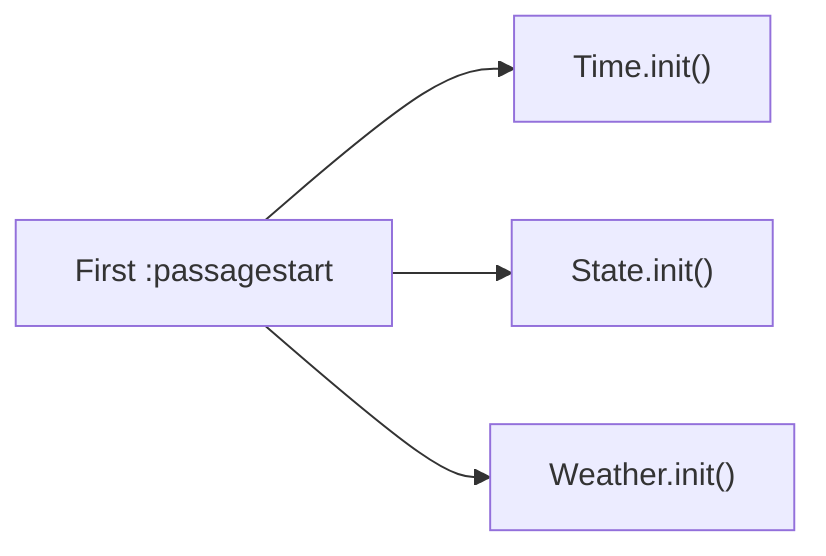

# Combat & Dynamic Events

## Combat System

The CombatManager module provides combat-related extension capabilities for Mods, including combat action registration, reaction system, and combat speech.

### Combat Actions

Register custom combat actions through the `CombatAction` submodule:

```js
const CombatAction = maplebirch.combat.CombatAction;

// 注册战斗动作
CombatAction.register({
  action: "myAction",
  type: "Default",
  name: "自定义动作",
  color: "green",
  difficulty: "<<myDifficultyWidget>>",
});
```

The `CombatAction` provides the following methods:

| Method                                         | Description                                         |
| ---------------------------------------------- | --------------------------------------------------- |
| `action(optionsTable, actionType, combatType)` | Inject custom actions into the combat options table |
| `difficulty(action, combatType)`               | Return the difficulty hint macro for custom actions |
| `color(action, encounterType)`                 | Return the color for custom actions                 |

### Reaction System

The `Reaction` submodule manages NPC reactions during combat:

```js
const Reaction = maplebirch.combat.Reaction;

Reaction.init();
```

### Combat Speech

The `Speech` submodule handles NPC speech during combat:

```js
const Speech = maplebirch.combat.Speech;

Speech.init();
```

### Combat Buttons

The framework automatically registers `generateCombatAction` and `combatButtonAdjustments` macros to enhance the game's combat button system:

- Supports list mode (`lists`, `limitedLists`) and radio button mode (`radio`, `columnRadio`)
- Color highlighting for custom actions
- Difficulty hint auto-updates when selecting from dropdown lists

### Ejaculation Events

The `ejaculation()` method provides custom ejaculation event macros for named NPCs:

```js
const macro = maplebirch.combat.ejaculation(npcIndex, "args");
// Returns macro string like "<<ejaculation-robin args>>"
```

## Dynamic Event System

The DynamicManager module manages three types of dynamic events: time events, state events, and weather events.

## Time Events

Register events that trigger at specific times:

```js
maplebirch.dynamic.regTimeEvent("daily", "myEvent", {
  // 时间事件配置
  callback: () => {
    // 事件逻辑
  },
});
```

| Method                                 | Description           |
| -------------------------------------- | --------------------- |
| `regTimeEvent(type, eventId, options)` | Register time event   |
| `delTimeEvent(type, eventId)`          | Unregister time event |
| `timeTravel(options)`                  | Execute time travel   |

### Time Travel

```js
maplebirch.dynamic.timeTravel({
  // 时间旅行配置
});
```

## State Events

Register events based on game state changes:

```js
maplebirch.dynamic.regStateEvent("interrupt", "myStateEvent", {
  // 状态事件配置
  callback: () => {
    // 事件逻辑
  },
});
```

State events support two types:

| Type        | Description          |
| ----------- | -------------------- |
| `interrupt` | Interrupt-type event |
| `overlay`   | Overlay-type event   |

Trigger a state event:

```js
const result = maplebirch.dynamic.trigger("interrupt");
```

## Weather Events

Register weather-related events and custom weather types:

```js
// 注册天气事件
maplebirch.dynamic.regWeatherEvent("myWeatherEvent", {
  // 天气事件配置
});

// 添加自定义天气类型或异常天气
maplebirch.dynamic.addWeather({
  // 天气数据
});
```

| Method                              | Description                           |
| ----------------------------------- | ------------------------------------- |
| `regWeatherEvent(eventId, options)` | Register weather event                |
| `delWeatherEvent(eventId)`          | Unregister weather event              |
| `addWeather(data)`                  | Add weather type or anomalous weather |

## Module Initialization

DynamicManager registers a `:passagestart` listener during the `preInit` phase. On the first Passage start, it initializes three sub-managers:


