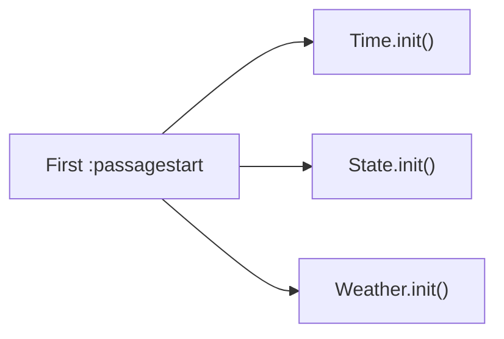

# Dynamic Events

The DynamicManager module manages three types of dynamic events: time events, state events, and weather events. Access via `maplebirch.dynamic`.

## Overview

| Event Type                         | Description                                     |
| ---------------------------------- | ----------------------------------------------- |
| [State Events](./state-events)     | Events triggered by game state changes          |
| [Time Events](./time-events)       | Events triggered at specific times              |
| [Weather Events](./weather-events) | Weather-related events and custom weather types |

## Module Initialization

DynamicManager registers a `:passagestart` listener during the `preInit` phase. On the first Passage start, it initializes three sub-managers:

