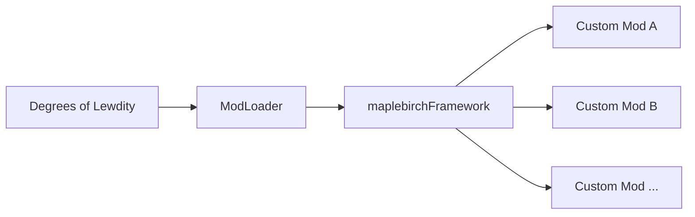

# Framework Overview

`maplebirchFramework` (package name: `maplebirch`, Chinese name: 秋枫白桦框架) is a modular mod development framework designed for **Degrees of Lewdity** (DOL) based on **Sugarcube2 ModLoader**. It provides a structured middle layer between ModLoader and individual mods, offering mod developers lifecycle management, shared services, and reusable tools.

## Niche

The framework is distributed as `.mod.zip` and loaded by ModLoader at startup. The entry point is compiled to `dist/inject_early.js` and injected via the `scriptFileList_inject_early` mechanism. At runtime, it exposes the global instance `window.maplebirch`, a singleton of the `MaplebirchCore` class.

## Runtime Dependencies

The framework declares the following hard dependencies, all of which must be loaded before `maplebirch`:

| Dependency          | Minimum Version | Purpose                                        |
| ------------------- | --------------- | ---------------------------------------------- |
| ModLoader           | >=2.0.0         | Core mod loader and lifecycle                  |
| ModLoaderGui        | >=1.0.0         | GUI panel host                                 |
| ModSubUiAngularJs   | >=1.0.0         | AngularJS component registration (settings UI) |
| ConflictChecker     | >=1.0.0         | Mod conflict detection                         |
| BeautySelectorAddon | >=2.0.0         | BSA image pipeline (NPC sidebar)               |
| ReplacePatcher      | >=1.0.0         | Passage content replacement                    |
| TweeReplacer        | >=1.0.0         | Twee passage replacement                       |
| GameVersion         | >=0.5.7.0       | Game version detection                         |

## Core Capabilities

The framework provides the following core modules:

- **AddonPlugin System** — Integrated with ModLoader lifecycle, handles automatic loading of scripts, NPCs, audio, and framework configuration
- **Variable Management** — Unified `V.maplebirch` namespace with default values and version migration support
- **Character Rendering** — body / head / face / clothing layer system, hair color gradients, mask generation
- **Named NPCs** — NPC registration and data management, sidebar model rendering, clothing system, scheduling
- **Combat System** — Combat actions, reactions, voice registration, combat button generation
- **Dynamic Events** — Time, state, weather event management and time travel
- **Audio Management** — Howler.js-based audio playback, playlist management
- **Tool Collection** — Console, random system, macros, HTML utilities, region management and other practical tools
- **GUI Control** — AngularJS settings UI, module enable/disable control
- **Internationalization** — Multi-language support (EN/CN), automatic translation file import
- **Event Bus** — `on` / `off` / `once` / `after` / `trigger` event system
- **Persistent Storage** — IndexedDB settings persistence
- **Logging System** — Leveled logging (DEBUG / INFO / WARN / ERROR)

## Global Access Paths

All features are accessed through the `window.maplebirch` singleton:

| Access Path          | Type             | Description                                               |
| -------------------- | ---------------- | --------------------------------------------------------- |
| `maplebirch.addon`   | AddonPlugin      | Plugin system and lifecycle hooks                         |
| `maplebirch.dynamic` | DynamicManager   | Dynamic events (time/state/weather)                       |
| `maplebirch.tool`    | ToolCollection   | Tool collection (console/random/macros/HTML/regions etc.) |
| `maplebirch.audio`   | AudioManager     | Audio playback and management                             |
| `maplebirch.var`     | Variables        | Variable management and migration                         |
| `maplebirch.char`    | Character        | Character rendering layer system                          |
| `maplebirch.npc`     | NPCManager       | Named NPC system                                          |
| `maplebirch.combat`  | CombatManager    | Combat system                                             |
| `maplebirch.gui`     | GUIControl       | GUI settings panel                                        |
| `maplebirch.lang`    | LanguageManager  | Internationalization and translation                      |
| `maplebirch.idb`     | IndexedDBService | IndexedDB storage                                         |
| `maplebirch.logger`  | Logger           | Logging service                                           |
| `maplebirch.tracer`  | EventEmitter     | Event bus                                                 |

The following convenience properties are also exposed:

| Property                 | Description                        |
| ------------------------ | ---------------------------------- |
| `maplebirch.yaml`        | `js-yaml` library (frozen)         |
| `maplebirch.howler`      | `{ Howl, Howler }` object (frozen) |
| `maplebirch.lodash`      | `lodash-es` library                |
| `maplebirch.SugarCube`   | SugarCube2 engine object           |
| `maplebirch.Language`    | Current language (getter/setter)   |
| `maplebirch.LogLevel`    | Log level (getter/setter)          |
| `maplebirch.gameVersion` | Current game version               |

## Modules & Features

- [**Utilities**](./services) — Core services: logging, events, language (includes `maplebirch.tool.utils`)
- [**Event Emitter**](./event-emitter) — Event publish/subscribe system
- [**Language Manager**](./language-manager) — Internationalization and translation
- [**Module System**](./module-system) — Module registration and lifecycle API
- [**SugarCube Macros**](./sugar-cube-macro) — Multi-language and stat/grace macros
- **Combat System** ([Combat](./combat/actions)) — Combat actions, reactions, speech, buttons
- **Dynamic Events** ([Dynamic Events](./dynamic/index))
  - [State Events](./dynamic/state-events)
  - [Time Events](./dynamic/time-events)
  - [Weather Events](./dynamic/weather-events)
- **Tool Collection** ([Tool Collection](./tool-collection/index))
  - [Utilities](./tool-collection/utils)
  - [Variable Migration](./variables#variable-migration-system)
  - [Random System](./tool-collection/rand-system)
  - [HTML Tools](./tool-collection/html-tools)
  - [Zones Manager](./tool-collection/zones-manager)
  - [Traits Registration](./tool-collection/traits)
  - [Location Config](./tool-collection/location)
  - [Bodywriting](./tool-collection/bodywriting)

## Feature highlights

- **Numeric clamping** — `number()` utility for range, rounding, step, and percent ([Utilities](./tool-collection/utils))
- **Mask rotation** — Character and NPC sidebar masks support rotation angle (`mask` and options)
- **Combat multi-slot** — Combat buttons can use an array of `actionType` to show in multiple slots ([Combat](./combat/actions))
- **Zone injection** — Use keys such as `MobileStats` to inject into mobile stats and other areas ([Zones Manager](./tool-collection/zones-manager))
- **Stat and grace display** — Macros such as `statChange` and `grace` for numeric output ([SugarCube macros](./sugar-cube-macro))
- **Pronouns with ModI18N** — When used with ModI18N, the framework corrects pronoun (his/hers) display for vanilla NPCs ([Named NPC](./named-npc))

## Next Steps

- [Getting Started](./getting-started) — How to add framework dependency to your Mod and use it
- [Core Architecture](./architecture) — Deep dive into MaplebirchCore and module system
- [AddonPlugin System](./addon-plugin) — Lifecycle hooks and configuration loading in detail
