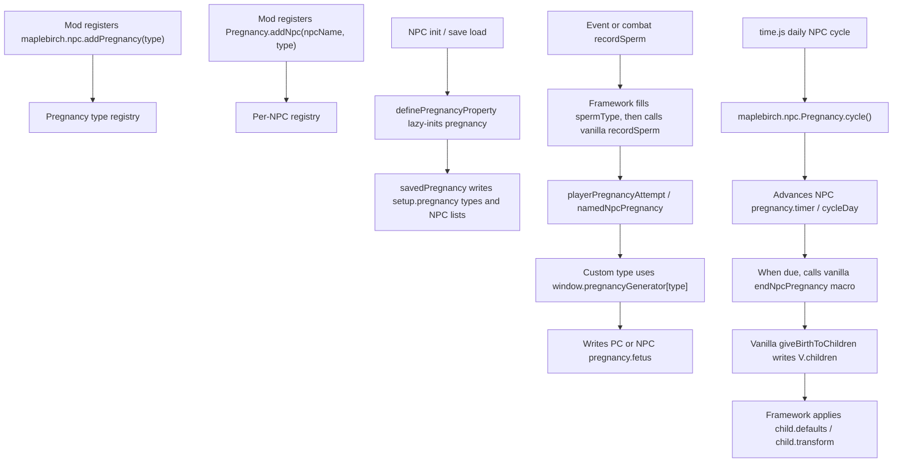

# NPC Pregnancy

NPC pregnancy support is a bridge into the vanilla pregnancy system. It does not turn one species into another.

The system is bidirectional:

- An NPC can impregnate the PC.
- The PC can impregnate an NPC.

The same pregnancy type and generator are used for both directions.

## Type And NPC Layers

Pregnancy registration has two layers:

- `maplebirch.npc.addPregnancy(type, config)` registers a pregnancy type. A type owns the generator, ETA, default birth locations, child config, baby wording, and transformation data.
- `maplebirch.npc.Pregnancy.addNpc(npcName, type, config)` registers a single NPC. An NPC entry decides whether that character joins the pregnancy system, which pregnancy type it uses, whether it can be pregnant or impregnate the PC, and whether it overrides cycle or birth behavior.

The two layers are separate. Multiple NPCs can use the same pregnancy type, and an NPC can use a pregnancy type different from its normal `npc.type`.

## NPC Data

Set `pregnancy.enabled` on NPCs that should join the pregnancy system. Set `pregnancy.type` to the pregnancy species used by sperm records and pregnancy generation.

```javascript
maplebirch.npc.add({
  nam: 'Plant Girl',
  type: 'plant',
  gender: 'f',
  vagina: 'clothed',
  penis: 'none',
  pregnancy: {
    enabled: true,
    type: 'plant'
  }
});
```

## Add Type

Custom pregnancy types are registered in script. Adding a type only lets the framework keep that type in pregnancy filters. It does not create pregnancy data by itself.

```javascript
maplebirch.npc.addPregnancy('plant');
```

## Full Registration

A custom type needs at least a `generator`. Other callbacks are optional, but they make remaining-day display, child activity, and baby wording work cleanly.

```javascript
maplebirch.npc.addPregnancy('plant', {
  generator(mother, father, fatherKnown, genital) {
    const pcIsMother = mother === 'pc';
    const pcIsFather = father === 'pc';

    return {
      type: 'plant',
      timer: 0,
      timerEnd: pcIsMother ? random(120, 180) : random(160, 220),
      fetus: [
        {
          type: 'plant',
          mother,
          father,
          fatherKnown: fatherKnown || pcIsFather,
          genital,
          birthId: 0,
          childId: `plant-${mother}-${father}-${Time.days}`,
          gender: 'f',
          features: {},
          localVariables: {}
        }
      ]
    };
  },

  eta(pregnancy) {
    return pregnancy.timerEnd ? Math.floor(pregnancy.timerEnd - pregnancy.timer) : null;
  },

  birth: {
    birthLocation: 'forest',
    location: 'home'
  },

  child: {
    defaults: {
      nursery: 'planter'
    },
    transform: 'plant',
    activity(childId, child) {
      return random(0, 1) ? 'sleeping' : 'sprouting';
    },
    text: {
      single: 'seedling',
      multiple: 'seedlings'
    }
  }
});
```

## Per-NPC Config

Use `maplebirch.npc.Pregnancy.addNpc()` when a vanilla or custom NPC should join the pregnancy system.

```javascript
maplebirch.npc.Pregnancy.addNpc('Some NPC', 'human', {
  canBePregnant: true,
  canImpregnatePlayer: false,
  multiplier: 1.5,
  birth: {
    birthLocation: 'home',
    location: 'home'
  },
  cycleMode: 'after',
  onMissedBirth(npcName, pregnancy) {
    pregnancy.missedBirth = true;
    pregnancy.missedBirthCount = (pregnancy.missedBirthCount || 0) + 1;
  }
});
```

If the NPC already has `pregnancy.type`, you can pass only config:

```javascript
maplebirch.npc.Pregnancy.addNpc('Some NPC', {
  type: 'plant',
  canBePregnant: true
});
```

You can also place per-NPC data inside a type registration:

```javascript
maplebirch.npc.addPregnancy('plant', {
  generator,
  npc: {
    'Some NPC': {
      multiplier: 1.5
    }
  }
});
```

## Config Fields

| Field | Type | Purpose |
| :--- | :--- | :--- |
| `generator` | `(mother, father, fatherKnown, genital) => pregnancy` | Creates pregnancy data and installs it into `window.pregnancyGenerator[type]`. |
| `birth` | Object or `(type, pregnancy, npcName) => object` | Registers default birth and child locations for this custom type or NPC. |
| `type` | String | NPC-only field. Selects which pregnancy type this NPC uses. |
| `enabled` | Boolean | NPC-only field. Set to `false` to keep override data without adding the NPC to pregnancy lists. |
| `canBePregnant` | Boolean | NPC-only field. Adds this NPC to `setup.pregnancy.canBePregnant`. |
| `canImpregnatePlayer` | Boolean | NPC-only field. Adds this NPC to `setup.pregnancy.canImpregnatePlayer`. |
| `multiplier` | Number or `(npcName, pregnancy) => number` | Daily pregnancy timer growth. |
| `autoEnd` | Boolean or `(npcName, pregnancy) => boolean` | Whether missed births should be resolved automatically after the grace period. |
| `cycleMode` | `'range'` or `'after'` | Fertility cycle check mode. |
| `forcePregnancy` | Boolean or `(npcName, pregnancy) => boolean` | Forces the pregnancy attempt to use the first available sperm when the random pick misses. |
| `nonCycleFlag` | String | Field written to the pregnancy object when non-cycle RNG succeeds. |
| `onMissedBirth` | `(npcName, pregnancy) => void` | Runs before an automatically resolved missed birth. |
| `npc` | `Record<npcName, config>` | Per-NPC overrides using the same fields above. |
| `eta` | `(pregnancy) => number \| null` | Overrides `window.pregnancyDaysEta()` for this custom type. |
| `child` | Object | Registers child defaults, transformation data, activity, and baby wording for children born from this type. |
| `childActivity` | `(childId, child) => string \| null \| false \| void` | Overrides `<<updateChildActivity>>` for children of this custom type. |
| `text` | Object or `(pregnancy, count, target) => string` | Overrides `<<pregnancyBabyText>>` wording for this custom type. |

## Callback Parameters

### `generator(mother, father, fatherKnown, genital)`

| Parameter | Meaning |
| :--- | :--- |
| `mother` | Pregnant side. It can be `'pc'` or a named NPC name. |
| `father` | Impregnating side. It can be `'pc'` or a named NPC name. |
| `fatherKnown` | Whether the father is known to the pregnancy record. |
| `genital` | Pregnancy location. Usually `'vagina'`; PC pregnancy can also pass another vanilla genital key. |

`mother === 'pc'` means an NPC made the PC pregnant. `father === 'pc'` means the PC made an NPC pregnant.

The returned object must contain a non-empty `fetus` array. If it should progress into vanilla birth and child systems, keep the structure close to vanilla pregnancy objects.

### `eta(pregnancy)`

| Parameter | Meaning |
| :--- | :--- |
| `pregnancy` | Current pregnancy object. For PC pregnancy this is usually `V.sexStats[genital].pregnancy`; for NPC pregnancy this is `C.npc[name].pregnancy`. |

Return remaining days, or `null` when no clean display is available.

### `birth`

`birth` can be a plain object:

```javascript
birth: {
  birthLocation: 'forest',
  location: 'home'
}
```

It can also be a resolver:

```javascript
birth(type, pregnancy) {
  return {
    birthLocation: type === 'plant' ? 'forest' : 'unknown',
    location: pregnancy?.npcAwareOf ? 'home' : 'forest'
  };
}
```

| Parameter | Meaning |
| :--- | :--- |
| `type` | Registered pregnancy type, such as `'plant'`. |
| `pregnancy` | Optional pregnancy object passed by framework callers. |
| `npcName` | Optional named NPC when the location is being resolved for a named NPC. |

| Returned Field | Meaning |
| :--- | :--- |
| `birthLocation` | Where birth happened. Vanilla stores this on each child as `V.children[childId].birthLocation`. |
| `location` | Where the child currently belongs after birth. Vanilla stores this on each child as `V.children[childId].location`. |

The registered data is read with `maplebirch.npc.Pregnancy.birthLocation(type, pregnancy, npcName)`. The framework resolves NPC-level data first, then type-level data, then falls back to `unknown`.

### `childActivity(childId, child)`

`child.activity` is the preferred location for this callback. The old top-level `childActivity` field still works when only activity needs to be registered.

| Parameter | Meaning |
| :--- | :--- |
| `childId` | Key used in `V.children`. |
| `child` | The child object at `V.children[childId]`. It normally contains fields such as `type`, `born`, `localVariables`, and vanilla child data. |

Return a string to write `child.localVariables.activity`. Return `null`, `false`, or `undefined` to mark the callback handled without changing activity.

### `child.defaults`

`child.defaults` runs after vanilla `<<endNpcPregnancy>>` has created `V.children[childId]`. It can be an object merged into the child, or a resolver:

```javascript
child: {
  defaults(child, pregnancy, npcName) {
    return {
      nursery: child.mother === 'pc' ? 'home' : 'forest',
      plantStage: 0
    };
  }
}
```

| Parameter | Meaning |
| :--- | :--- |
| `child` | The newly created `V.children[childId]` entry. |
| `pregnancy` | The pregnancy object that produced this child. |
| `npcName` | Named NPC mother when the birth came from an NPC pregnancy. |

Use this for custom child fields that should exist only after birth. Fields required during pregnancy should still be created by the `generator` inside each fetus object.

### `child.transform`

`child.transform` supports vanilla child transformation fields and framework-added transformation data. Vanilla stores these values under `child.features`, so the framework writes them after birth.

The common form is a string:

```javascript
child: {
  transform: 'plant'
}
```

This writes `child.features.maplebirchTransform = 'plant'`.

```javascript
child: {
  transform: {
    animal: 'wolf',
    divine: 'angel',
    maplebirch: 'plant',
    features: {
      plantStage: 1
    }
  }
}
```

| Field | Written To | Purpose |
| :--- | :--- | :--- |
| `animal` | `child.features.beastTransform` | Animal transformation marker. The value may be a vanilla animal transform or a framework-added physical/animal transform name. |
| `divine` | `child.features.divineTransform` | Divine transformation marker. The value may be a vanilla divine/demon transform or a framework-added divine transform name. |
| `maplebirch` | `child.features.maplebirchTransform` | Framework or mod-added transformation marker. |
| `features` | `child.features` | Directly appends any vanilla-compatible feature fields. |

`transform` can also be a function with the same parameters as `child.defaults` when the result depends on parents, location, or NPC.

### `text(pregnancy, count, target)`

| Parameter | Meaning |
| :--- | :--- |
| `pregnancy` | Pregnancy object being displayed. |
| `count` | Display count. The framework uses `1` unless vanilla awareness flags reveal multiples. |
| `target` | Optional display target passed by `<<pregnancyBabyText>>`; usually `undefined`, `'pc'`, or a named NPC name. |

## Child-Only Registration

Use `maplebirch.npc.Pregnancy.addChild()` when the generator is registered elsewhere and you only need child fields, transformation data, activity, or wording:

```javascript
maplebirch.npc.Pregnancy.addChild('plant', {
  defaults: {
    nursery: 'planter'
  },
  transform: 'plant',
  activity(childId, child) {
    return child.location === 'forest' ? 'sprouting' : 'sleeping';
  },
  text: {
    single: 'seedling',
    multiple: 'seedlings'
  }
});
```

## Runtime Flow



## Runtime Touch Points

| Entry | Vanilla Role | Framework Role |
| :--- | :--- | :--- |
| `setup.pregnancy.typesEnabled` | Filters valid sperm types in `recordSperm`. | Adds custom pregnancy types. |
| `window.pregnancyGenerator` | Stores vanilla pregnancy generators. | Adds custom generators. |
| `window.recordSperm` | Records sperm from Twine events and combat. | Fills `spermType` for custom named NPCs before calling vanilla logic. |
| `time.js` daily `npcPregnancyCycle()` call | Vanilla daily NPC pregnancy cycle. | Replaced with `maplebirch.npc.Pregnancy.cycle()` so the framework has one daily entry point. |
| `<<playerPregnancyAttempt>>` | Attempts PC pregnancy. | Handles custom sperm, otherwise delegates to vanilla macro. |
| `<<namedNpcPregnancy>>` | Makes a named NPC pregnant. | Handles custom mother/father type combinations, otherwise delegates to vanilla macro. |
| `<<endNpcPregnancy>>` | Ends named NPC pregnancy and calls vanilla child birth logic. | Resolves registered birth locations before delegating to vanilla macro. |
| `window.pregnancyDaysEta()` | Displays remaining pregnancy days. | Uses registered `eta` for custom types. |
| `<<updateChildActivity>>` | Updates child daily activity. | Uses registered `childActivity` for custom child types. |
| `<<pregnancyBabyText>>` | Outputs baby/pup/chick text. | Uses registered `text` for custom types. |

`npcPregnancyCycle()` is a closure function inside vanilla `time.js` / `pregnancy.js`, so the framework does not call the original function. Instead, the `time.js` call site is patched to call the framework cycle. `giveBirthToChildren()` stays inside vanilla and is reached through the original `<<endNpcPregnancy>>` macro.

## Vanilla Route

Vanilla species and special NPC behavior are represented as default data inside the framework. Custom mods use the same type-level and NPC-level configuration path instead of adding new hardcoded branches.
