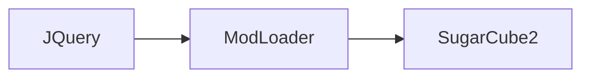
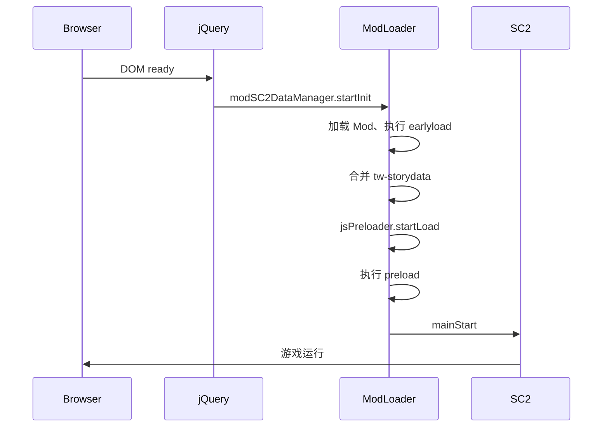
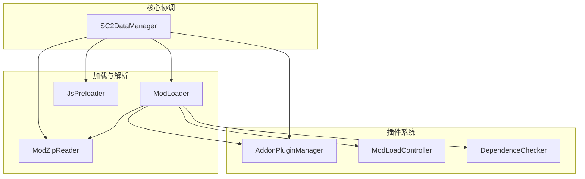
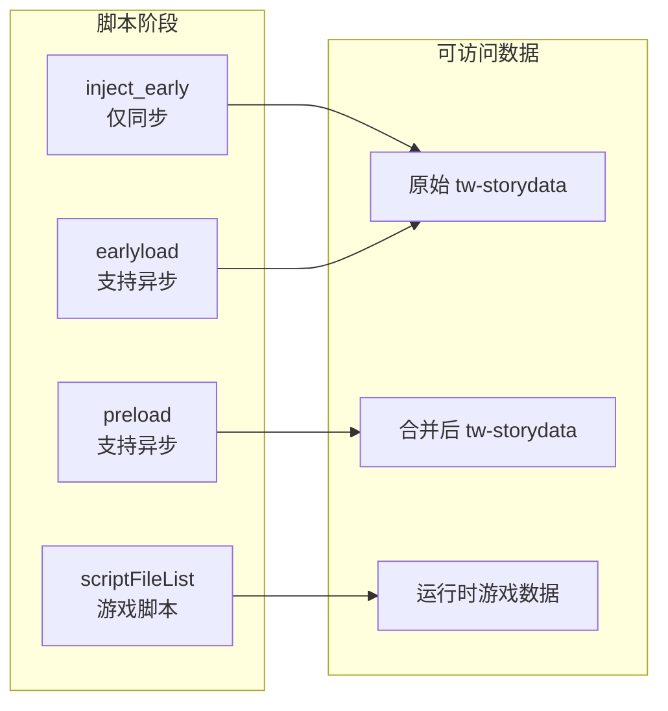

# 系统架构

## 启动序列

ModLoader 将原本的 `jQuery -> SC2` 启动顺序变为 `jQuery -> ModLoader -> SC2`：



详细时序：



## ModLoader 如何接入 SugarCube2

SugarCube2 是一个**全同步**的渲染引擎，它以完全同步的方式将游戏脚本（twee、JS、CSS）动态翻译为 HTML 并显示。这些游戏脚本以文本形式内嵌在编译后的网页 HTML 的 `tw-storydata` 节点中。

SugarCube2 的启动代码位于 `sugarcube.js` 的一个 `jQuery(() => {})` 闭包函数中，在网页加载完成后执行。ModLoader 通过修改这个闭包，将原始启动代码包装到一个 `mainStart()` 函数中，并在其前面插入一个异步等待，使得 ModLoader 可以在引擎启动前完成所有 Mod 的加载和注入工作。

### SC2 注入点

ModLoader 所需的唯一注入点位于 [sugarcube.js](https://github.com/Lyoko-Jeremie/sugarcube-2_Vrelnir/blob/TS/src/sugarcube.js)：

```js
jQuery(() => {
  'use strict';

  const mainStart = () => {
    // 原来的 jQuery(() => {}) 的内容
  };

  if (typeof window.modSC2DataManager !== 'undefined') {
    window.modSC2DataManager.startInit()
      .then(() => window.jsPreloader.startLoad())
      .then(() => mainStart())
      .catch(err => {
        console.error(err);
      });
  } else {
    mainStart();
  }
});
```

这将原本的启动顺序从 `jQuery -> SC2` 变为：

```
jQuery -> ModLoader -> SC2
```

整个 Mod 加载过程（包括获取 zip 文件、执行早期脚本、合并 `tw-storydata`）都在 SugarCube2 读取任何游戏数据之前完成。

## 核心组件关系



## 四阶段脚本加载与数据可用性

各脚本阶段可访问的数据类型：



## 全局对象

ModLoader 向 Mod 脚本暴露三个全局对象：

| 全局对象 | 类型 | 作用 |
|---------|------|------|
| `window.modSC2DataManager` | SC2DataManager | 核心协调器，持有所有子系统 |
| `window.modUtils` | ModUtils | 面向 Mod 开发者的公共 API |
| `window.jsPreloader` | JsPreloader | 在合并后执行 preload 脚本 |

## 核心组件

### SC2DataManager

中央管理器，负责初始化所有内部对象和功能性插件。调用 `startInit()` 时会：

1. 保存原始未修改的 `tw-storydata` 节点内容（通过 `initSC2DataInfoCache()`）
2. 初始化所有内部组件（ModLoader、ModZipReader、JsPreloader 等）
3. 启动 Mod 加载流程

### ModLoader

核心加载器，负责从各个来源读取 Mod zip 文件，执行脚本，注册 Addon，并将 Mod 数据合并到游戏中。

### ModZipReader

负责读取 Mod 的 zip 压缩包，解析其中的 `boot.json` 文件以了解 Mod 的结构和需求。

### JsPreloader

负责执行 `scriptFileList_earlyload` 和 `scriptFileList_preload` 阶段的脚本。其执行器将 JS 代码包装为 `(async () => { return ${jsCode} })()` 形式并等待异步调用完成。

:::warning
由于 `JsPreloader.JsRunner()` 会在代码第一行前添加 `return`，按照 JS 语义，只会执行第一行代码或从第一行开始的闭包函数。
:::

### AddonPluginManager

管理 Addon 插件的注册与分发。Addon Mod 在 `EarlyLoad` 阶段调用 `registerAddonPlugin()` 注册自己，普通 Mod 在 `boot.json` 中通过 `addonPlugin` 字段声明依赖。

### DependenceChecker

在 Mod 加载时执行依赖检查，验证 `boot.json` 中 `dependenceInfo` 声明的版本约束是否满足。

### SC2DataInfo 与 SC2DataInfoCache

ModLoader 在启动时通过 `initSC2DataInfoCache()` 保存原始未修改的 `tw-storydata` 节点内容到 `SC2DataInfoCache`。每个 `SC2DataInfo` 实例封装了游戏数据的只读访问接口。

**作用**：

- 在 earlyload 和 preload 阶段，Mod 脚本可以读取原始或合并后的 Passage、CSS、JS 数据
- earlyload 阶段访问的是原始数据，preload 阶段访问的是合并后的最终数据
- 确保 Mod 在不同阶段能够正确获取所需数据，支持 TweeReplacer、ReplacePatch 等 Addon 的替换逻辑

## 整体结构

ModLoader 与游戏的关系结构：

```
((SC2引擎 + 游戏本体)[游戏] + (ModLoader + Mod)[Mod框架])
```

其中 Mod 框架细分为：

```
(
  (
    ModLoader +
    (
      ModLoaderGui[Mod管理器界面] +
      Addon[扩展插件]
    )[预置Mod]
  )[植入到HTML] + 其他Mod[上传或远程加载]
)
```

### 打包后的结构

```
((定制SC2引擎 + 原版游戏) + ModLoader)
```

打包流程：
1. 构建修改版 SC2 引擎，获得 `format.js`
2. 用 `format.js` 覆盖游戏项目的 `devTools/tweego/storyFormats/sugarcube-2/format.js`，编译游戏
3. 用 `insert2html.js` 将 ModLoader 注入到游戏 HTML 中

## 定制版 SugarCube2 的修改

ModLoader 需要使用经过修改的 SC2 引擎（[仓库地址](https://github.com/Lyoko-Jeremie/sugarcube-2_Vrelnir)），主要修改包括：

1. **修改启动点**：在 jQuery 闭包中插入 ModLoader 的异步等待
2. **Wikifier 增强**：添加 `_lastPassageQ` 及对应数据操作来跟踪脚本编译过程，涉及 `macrolib.js`、`parserlib.js`、`wikifier.js`（可使用 `passageObj` 关键字查找）
3. **图片标签拦截**：拦截 `img` 和 `svg` 标签，实现完全从内存加载所有图片（无需服务器）
