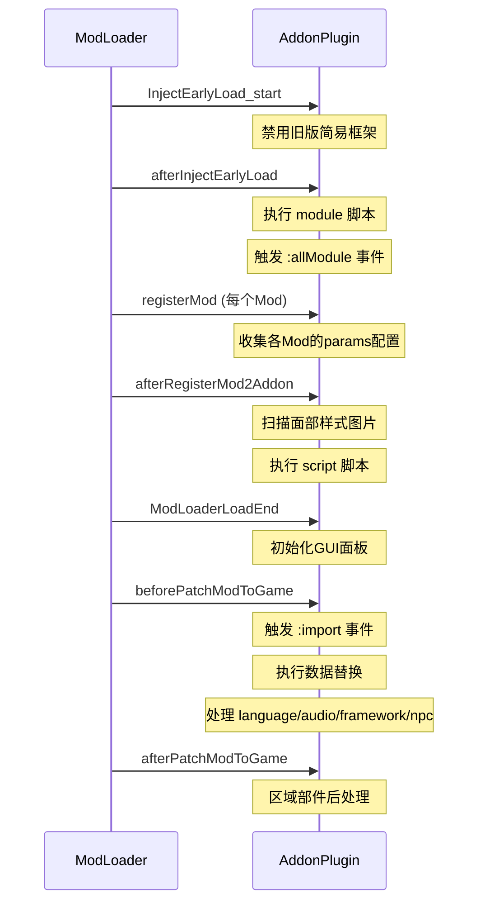

# AddonPlugin 系统

AddonPlugin 是 maplebirchFramework 与 ModLoader 生命周期集成的核心模块。它负责接收其他 Mod 的注册请求，处理脚本加载、语言文件导入、音频导入、NPC 配置和框架配置。

## 注册机制

框架在 `inject_early` 阶段向 ModLoader 注册自身：

```js
modAddonPluginManager.registerAddonPlugin("maplebirch", "maplebirchAddon", this);
modSC2DataManager.getModLoadController().addLifeTimeCircleHook("maplebirchFramework", this);
```

其他 Mod 通过 `boot.json` 的 `addonPlugin` 字段注册到框架：

```json
{
  "addonPlugin": [
    {
      "modName": "maplebirch",
      "addonName": "maplebirchAddon",
      "modVersion": "^2.7.0",
      "params": {
        "script": ["mymod.js"],
        "language": true,
        "audio": true,
        "npc": { ... },
        "framework": { ... }
      }
    }
  ]
}
```

## 生命周期钩子

AddonPlugin 实现了 ModLoader 的 `LifeTimeCircleHook` 接口，按以下顺序执行：



## params 配置详解

### script

JavaScript 脚本文件列表，在 `afterRegisterMod2Addon` 阶段执行。这是最常用的配置项。

```json
{
  "params": {
    "script": ["framework.js", "events.js"]
  }
}
```

脚本可以通过 GUI 面板被禁用。脚本键格式为 `[ModName]:filePath`。

### module

在 `afterInjectEarlyLoad` 阶段执行的脚本文件，执行时机早于 `script`。适用于需要注册自定义模块的场景。

```json
{
  "params": {
    "module": ["early-init.js"]
  }
}
```

:::warning
`module` 脚本在非常早期执行，此时框架可能尚未完全初始化。非必要不推荐使用。
:::

### language

语言文件配置，支持三种格式：

**自动导入所有语言：**

```json
{ "language": true }
```

从 `translations/` 目录自动查找并导入 JSON/YAML 格式的翻译文件。

**指定语言列表：**

```json
{ "language": ["CN", "EN"] }
```

导入 `translations/cn.json` 和 `translations/en.json`。

**自定义路径：**

```json
{
  "language": {
    "CN": { "file": "i18n/chinese.json" },
    "EN": { "file": "i18n/english.yml" }
  }
}
```

翻译文件格式为简单的 key-value 对：

```json
{
  "greeting": "你好",
  "farewell": "再见"
}
```

### audio

音频文件配置。

**默认路径导入：**

```json
{ "audio": true }
```

从 `audio/` 目录导入所有音频文件（mp3、wav、ogg、m4a、flac、webm）。

**自定义路径：**

```json
{ "audio": ["sounds/bgm", "sounds/sfx"] }
```

### npc

NPC 配置对象，包含以下子项：

```json
{
  "npc": {
    "NamedNPC": [[{ "nam": "MyNPC", "gender": "f" }, { "love": { "maxValue": 100 } }, {}]],
    "Stats": { "customStat": { "maxValue": 100 } },
    "Sidebar": {
      "clothes": ["npc/clothes.json"],
      "image": ["img/npc/"],
      "config": ["npc/config.json"]
    }
  }
}
```

每个 `NamedNPC` 条目是一个三元组 `[NPCData, NPCConfig, Translations]`。详见 [命名 NPC 系统](./named-npc)。

### framework

框架级配置，支持特质注册和区域部件添加。

**注册特质：**

```json
{
  "framework": {
    "traits": [
      {
        "title": "勇敢",
        "name": "brave",
        "colour": "green",
        "has": "V.brave >= 1",
        "text": "角色展现出勇气"
      }
    ]
  }
}
```

**添加区域部件：**

```json
{
  "framework": {
    "addto": "sidebar",
    "widget": "<<myWidget>>"
  }
}
```

也可使用带条件的部件配置：

```json
{
  "framework": {
    "addto": "sidebar",
    "widget": {
      "widget": "<<myWidget>>",
      "exclude": ["Combat"],
      "match": ["Home"],
      "passage": "MyPassage"
    }
  }
}
```

## 数据替换

在 `beforePatchModToGame` 阶段，AddonPlugin 会执行以下游戏数据修改：

- 修改日期格式选项（Options Overlay）
- 修改天气 JavaScript（WeatherManager）
- 修改 PC 模型（Character）
- 修改面部样式（Character）
- 修改变换效果（Transformation）

这些修改使用 `replace()` 工具函数通过正则表达式替换 Passage 和脚本内容。
