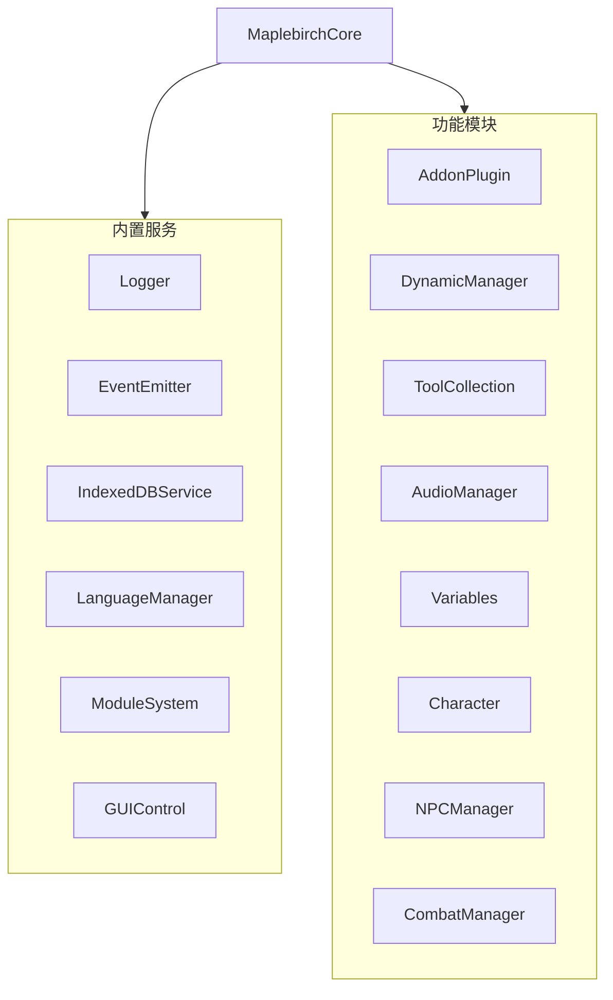
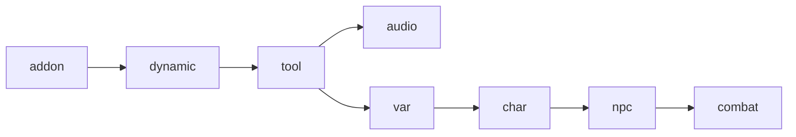
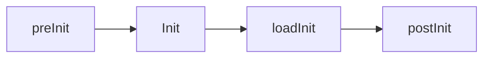
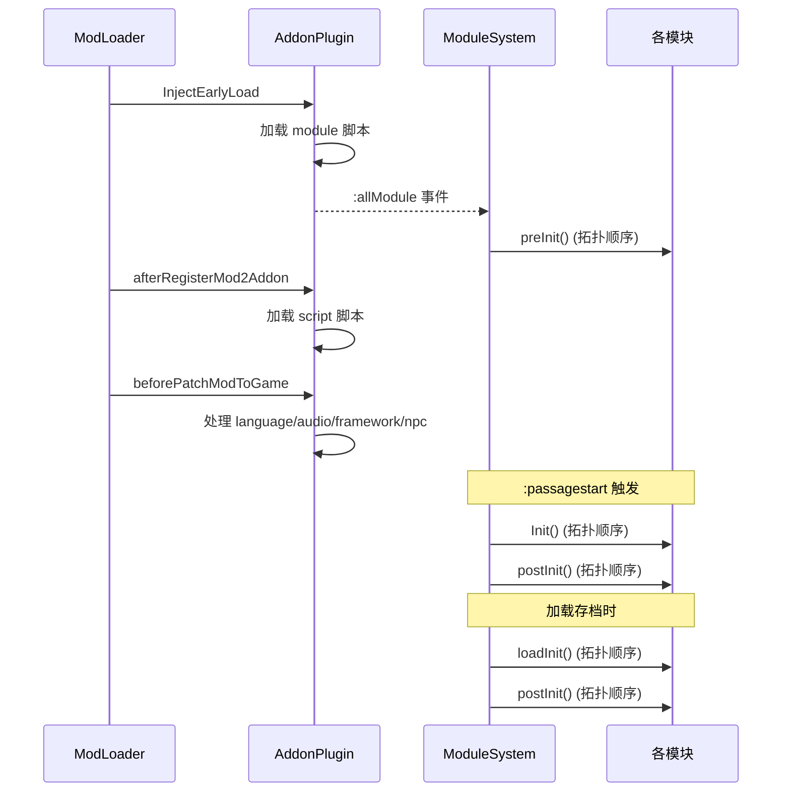

# 核心架构

本文介绍 maplebirchFramework 的内部架构，包括核心类结构、模块系统和初始化流程。

## MaplebirchCore

`MaplebirchCore` 是框架的中心对象，作为 `window.maplebirch` 的单例暴露。它在构造时实例化 6 个内置服务，并通过 `ModuleSystem` 注册 8 个功能模块。



### 服务初始化顺序

服务在构造函数中按以下顺序创建：

1. `Logger` — 日志服务
2. `EventEmitter` — 事件总线
3. `IndexedDBService` — 数据库服务
4. `LanguageManager` — 国际化
5. `ModuleSystem` — 模块注册与生命周期
6. `GUIControl` — 设置 UI

所有服务使用 `Object.seal()` 冻结，防止运行时修改。

## 模块系统

`ModuleSystem` 负责管理所有功能模块的注册、依赖解析和生命周期。完整 API 参考（`register`、`getModule`、`dependencyGraph`、生命周期方法）见 [ModuleSystem API](./module-system)。

### 模块注册

模块通过 `maplebirch.register(name, module, dependencies)` 注册。每个模块自注册时声明依赖关系：

```js
// 注册模块，声明依赖 'tool'
maplebirch.register('var', new Variables(maplebirch), ['tool']);
```

### 模块依赖图

框架的 8 个核心模块形成如下依赖关系：



| 模块 | 注册名 | 依赖 |
|------|-------|------|
| AddonPlugin | `addon` | 无 |
| DynamicManager | `dynamic` | `addon` |
| ToolCollection | `tool` | `dynamic` |
| AudioManager | `audio` | `tool` |
| Variables | `var` | `tool` |
| Character | `char` | `var` |
| NPCManager | `npc` | `char` |
| CombatManager | `combat` | `npc` |

### Early Mount

`addon`、`dynamic`、`tool`、`char` 被标记为 early mount 模块。这些模块在注册时就会挂载到 `maplebirch` 实例上（如果依赖已满足），而非等到预初始化阶段。

### 拓扑排序

模块系统使用拓扑排序确定初始化顺序，通过 Kahn 算法实现。如果检测到循环依赖，注册会被拒绝并记录错误日志。

### 扩展模块

第三方模块可以通过传递 `source` 参数注册为扩展模块：

```js
maplebirch.register('myModule', myModuleInstance, [], 'MyModName');
```

扩展模块直接挂载到 `maplebirch` 实例上，可通过 GUI 面板启用/禁用。

## 四阶段初始化

模块系统管理四个初始化阶段，每个模块可以实现对应的方法：



| 阶段 | 方法 | 触发时机 | 说明 |
|------|------|---------|------|
| 预初始化 | `preInit()` | `:allModule` 事件后 | 模块注册完成后的首次初始化 |
| 主初始化 | `Init()` | `:passagestart` 事件 | 每次 Passage 开始时执行（仅首次） |
| 存档初始化 | `loadInit()` | 加载存档后 | 读档时重新初始化状态 |
| 后初始化 | `postInit()` | `Init` 或 `loadInit` 完成后 | 每次 Passage 的后处理 |

### 执行流程



## 模块状态

每个模块在其生命周期中经历以下状态：

| 状态 | 说明 |
|------|------|
| `REGISTERED` | 已注册，等待初始化 |
| `LOADED` | Early Mount 完成或预初始化完成 |
| `MOUNTED` | 主初始化完成，完全可用 |
| `ERROR` | 初始化失败 |
| `EXTENSION` | 扩展模块（第三方注册） |

## 事件系统集成

`MaplebirchCore` 将 SugarCube2 的 jQuery 事件桥接到自身的事件总线：

- `:passageinit` / `:passagestart` / `:passagerender` / `:passagedisplay` / `:passageend`
- `:storyready`

此外框架还定义了内部事件：

- `:IndexedDB` — 数据库注册
- `:import` — 数据导入
- `:allModule` — 所有模块注册完成
- `:onSave` / `:onLoad` / `:onLoadSave` — 存档相关
- `:language` — 语言切换
- `:modLoaderEnd` — ModLoader 加载结束
