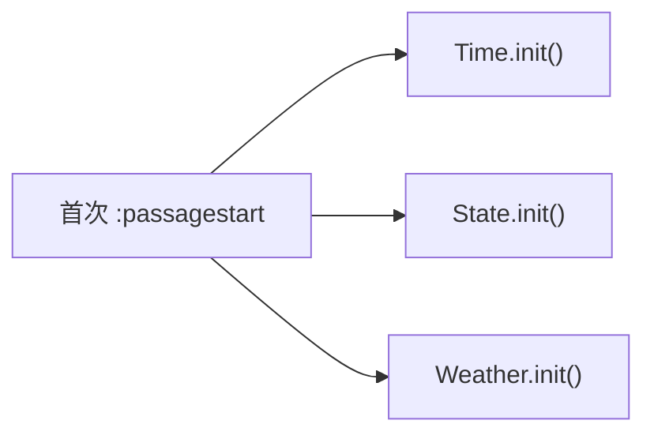

# 战斗与动态事件

## 战斗系统

CombatManager 模块为 Mod 提供战斗相关的扩展能力，包括战斗动作注册、反应系统和战斗语音。

### 战斗动作

通过 `CombatAction` 子模块注册自定义战斗动作：

```js
const CombatAction = maplebirch.combat.CombatAction;

// 注册战斗动作
CombatAction.register({
  action: 'myAction',
  type: 'Default',
  name: '自定义动作',
  color: 'green',
  difficulty: '<<myDifficultyWidget>>'
});
```

`CombatAction` 提供以下方法：

| 方法 | 说明 |
|------|------|
| `action(optionsTable, actionType, combatType)` | 向战斗选项表中注入自定义动作 |
| `difficulty(action, combatType)` | 返回自定义动作的难度提示宏 |
| `color(action, encounterType)` | 返回自定义动作的颜色 |

### 反应系统

`Reaction` 子模块管理战斗中的 NPC 反应：

```js
const Reaction = maplebirch.combat.Reaction;

Reaction.init();
```

### 战斗语音

`Speech` 子模块处理战斗中的 NPC 语音：

```js
const Speech = maplebirch.combat.Speech;

Speech.init();
```

### 战斗按钮

框架自动注册 `generateCombatAction` 和 `combatButtonAdjustments` 宏，增强游戏的战斗按钮系统：

- 支持列表模式（`lists`、`limitedLists`）和单选按钮模式（`radio`、`columnRadio`）
- 自定义动作的颜色标注
- 下拉列表选择时自动更新难度提示

### 射精事件

`ejaculation()` 方法为命名 NPC 提供自定义射精事件宏：

```js
const macro = maplebirch.combat.ejaculation(npcIndex, 'args');
// 返回如 "<<ejaculation-robin args>>" 的宏字符串
```

## 动态事件系统

DynamicManager 模块管理三种类型的动态事件：时间事件、状态事件和天气事件。

### 时间事件

注册在特定时间触发的事件：

```js
maplebirch.dynamic.regTimeEvent('daily', 'myEvent', {
  // 时间事件配置
  callback: () => {
    // 事件逻辑
  }
});
```

| 方法 | 说明 |
|------|------|
| `regTimeEvent(type, eventId, options)` | 注册时间事件 |
| `delTimeEvent(type, eventId)` | 注销时间事件 |
| `timeTravel(options)` | 执行时间旅行 |

### 时间旅行

```js
maplebirch.dynamic.timeTravel({
  // 时间旅行配置
});
```

### 状态事件

注册基于游戏状态变化的事件：

```js
maplebirch.dynamic.regStateEvent('interrupt', 'myStateEvent', {
  // 状态事件配置
  callback: () => {
    // 事件逻辑
  }
});
```

状态事件支持两种类型：

| 类型 | 说明 |
|------|------|
| `interrupt` | 中断型事件 |
| `overlay` | 覆盖型事件 |

触发状态事件：

```js
const result = maplebirch.dynamic.trigger('interrupt');
```

### 天气事件

注册天气相关事件和自定义天气类型：

```js
// 注册天气事件
maplebirch.dynamic.regWeatherEvent('myWeatherEvent', {
  // 天气事件配置
});

// 添加自定义天气类型或异常天气
maplebirch.dynamic.addWeather({
  // 天气数据
});
```

| 方法 | 说明 |
|------|------|
| `regWeatherEvent(eventId, options)` | 注册天气事件 |
| `delWeatherEvent(eventId)` | 注销天气事件 |
| `addWeather(data)` | 添加天气类型或异常天气 |

### 模块初始化

DynamicManager 在 `preInit` 阶段注册 `:passagestart` 监听器，在首次 Passage 开始时初始化三个子管理器：


