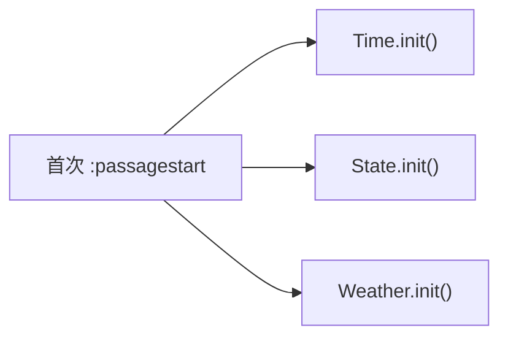

# 动态事件

DynamicManager 模块管理三种类型的动态事件：时间事件、状态事件和天气事件。通过 `maplebirch.dynamic` 访问。

## 概览

| 事件类型                     | 说明                         |
| ---------------------------- | ---------------------------- |
| [状态事件](./state-events)   | 基于游戏状态变化触发的事件   |
| [时间事件](./time-events)    | 在特定时间触发的事件         |
| [天气事件](./weather-events) | 天气相关事件与自定义天气类型 |

## 模块初始化

DynamicManager 在 `preInit` 阶段注册 `:passagestart` 监听器，在首次 Passage 开始时初始化三个子管理器：

