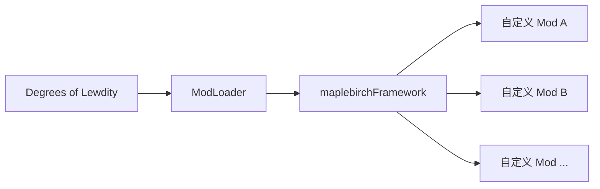

# 框架概述

`maplebirchFramework`（包名：`maplebirch`，中文名：秋枫白桦框架）是基于 **Sugarcube2 ModLoader** 为 **Degrees of Lewdity** (DOL) 设计的模块化模组开发框架。它在 ModLoader 和具体模组之间提供了一层结构化的中间层，为模组开发者提供生命周期管理、共享服务和可复用工具。

## 生态位

框架以 `.mod.zip` 形式分发，由 ModLoader 在启动时加载。入口编译为 `dist/inject_early.js`，通过 `scriptFileList_inject_early` 机制注入。运行时暴露全局实例 `window.maplebirch`，即 `MaplebirchCore` 类的单例。

## 运行时依赖

框架声明了以下硬依赖，全部需在 `maplebirch` 之前加载：

| 依赖                | 最低版本  | 作用                          |
| ------------------- | --------- | ----------------------------- |
| ModLoader           | >=2.0.0   | 核心模组加载器与生命周期      |
| ModLoaderGui        | >=1.0.0   | GUI 面板宿主                  |
| ModSubUiAngularJs   | >=1.0.0   | AngularJS 组件注册（设置 UI） |
| ConflictChecker     | >=1.0.0   | 模组冲突检测                  |
| BeautySelectorAddon | >=2.0.0   | BSA 图片管线（NPC 侧边栏）    |
| ReplacePatcher      | >=1.0.0   | Passage 内容替换              |
| TweeReplacer        | >=1.0.0   | Twee Passage 替换             |
| GameVersion         | >=0.5.7.0 | 游戏版本检测                  |

## 核心能力

框架提供以下核心功能模块：

- **AddonPlugin 系统** — 与 ModLoader 生命周期集成，处理脚本、NPC、音频、框架配置的自动加载
- **变量管理** — 统一的 `V.maplebirch` 命名空间，支持默认值与版本迁移
- **角色渲染** — body / head / face / clothing 图层系统，发色渐变、遮罩生成
- **命名 NPC** — NPC 注册与数据管理、侧边栏模型渲染、服装系统、日程安排
- **战斗系统** — 战斗动作、反应、语音注册，战斗按钮生成
- **动态事件** — 时间、状态、天气事件管理与时间旅行
- **音频管理** — 基于 Howler.js 的音频播放、播放列表管理
- **工具集合** — 控制台、随机系统、宏定义、HTML 工具、区域管理等实用工具
- **GUI 控制** — AngularJS 设置 UI、模块启用/禁用控制
- **国际化** — 多语言支持（EN/CN），翻译文件自动导入
- **事件总线** — `on` / `off` / `once` / `after` / `trigger` 事件系统
- **持久化存储** — IndexedDB 设置持久化
- **日志系统** — 分级日志（DEBUG / INFO / WARN / ERROR）

## 全局访问路径

所有功能均通过 `window.maplebirch` 单例访问：

| 访问路径             | 类型             | 说明                                   |
| -------------------- | ---------------- | -------------------------------------- |
| `maplebirch.addon`   | AddonPlugin      | 插件系统与生命周期钩子                 |
| `maplebirch.dynamic` | DynamicManager   | 动态事件（时间/状态/天气）             |
| `maplebirch.tool`    | ToolCollection   | 工具集合（控制台/随机/宏/HTML/区域等） |
| `maplebirch.audio`   | AudioManager     | 音频播放与管理                         |
| `maplebirch.var`     | Variables        | 变量管理与迁移                         |
| `maplebirch.char`    | Character        | 角色渲染图层系统                       |
| `maplebirch.npc`     | NPCManager       | 命名 NPC 系统                          |
| `maplebirch.combat`  | CombatManager    | 战斗系统                               |
| `maplebirch.gui`     | GUIControl       | GUI 设置面板                           |
| `maplebirch.lang`    | LanguageManager  | 国际化翻译                             |
| `maplebirch.idb`     | IndexedDBService | IndexedDB 存储                         |
| `maplebirch.logger`  | Logger           | 日志服务                               |
| `maplebirch.tracer`  | EventEmitter     | 事件总线                               |

此外还暴露了以下便捷属性：

| 属性                     | 说明                            |
| ------------------------ | ------------------------------- |
| `maplebirch.yaml`        | `js-yaml` 库（冻结）            |
| `maplebirch.howler`      | `{ Howl, Howler }` 对象（冻结） |
| `maplebirch.lodash`      | `lodash-es` 库                  |
| `maplebirch.SugarCube`   | SugarCube2 引擎对象             |
| `maplebirch.Language`    | 当前语言（getter/setter）       |
| `maplebirch.LogLevel`    | 日志级别（getter/setter）       |
| `maplebirch.gameVersion` | 当前游戏版本                    |

## 模块与功能

- [**工具函数**](./services) — 日志、事件与语言等核心服务（含 `maplebirch.tool.utils`）
- [**事件发射器**](./event-emitter) — 事件发布/订阅系统
- [**语言管理**](./language-manager) — 国际化与翻译
- [**模块系统**](./module-system) — 模块注册与生命周期 API
- **战斗系统**（[战斗](./combat)）— 战斗动作、反应、语音、按钮
- **动态事件**（[动态事件](./dynamic/index)）
  - [状态事件](./dynamic/state-events)
  - [时间事件](./dynamic/time-events)
  - [天气事件](./dynamic/weather-events)
- **工具合集**（[工具集合](./tool-collection/index)）
  - [变量迁移](./variables#变量迁移系统)
  - [随机数系统](./tool-collection/rand-system)
  - [文本工具](./tool-collection/html-tools)
  - [区域管理](./tool-collection/zones-manager)
  - [特质注册](./tool-collection/traits)
  - [地点配置](./tool-collection/location)
  - [纹身注册](./tool-collection/bodywriting)

## 下一步

- [快速开始](./getting-started) — 如何让你的 Mod 依赖并使用框架
- [核心架构](./architecture) — 深入了解 MaplebirchCore 与模块系统
- [AddonPlugin 系统](./addon-plugin) — 生命周期钩子与配置加载详解
