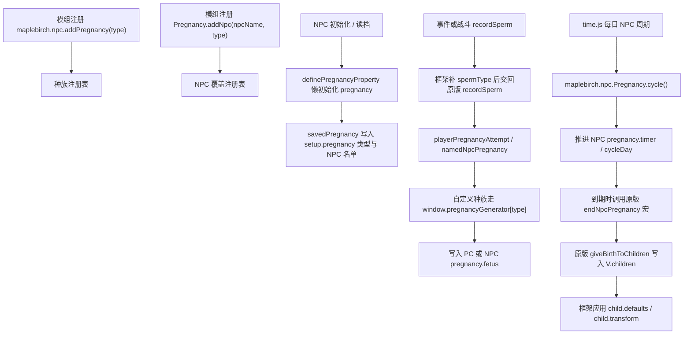

# NPC 怀孕

NPC 怀孕是接入原版怀孕系统的桥。它不会把一个种族伪装成另一个种族，而是让新种族拥有自己的精液记录、受孕生成、周期推进、出生地点、孩子活动、宝宝称呼和转化数据。

这个系统是双向的：

- NPC 可以让 PC 怀孕。
- PC 也可以让 NPC 怀孕。

同一个怀孕种族和同一个生成器会同时服务这两个方向。

## 两层模型

怀孕注册分为两层：

- `maplebirch.npc.addPregnancy(type, config)` 注册怀孕种族。种族决定生成器、剩余天数、出生地点默认值、孩子配置、称呼和转化。
- `maplebirch.npc.Pregnancy.addNpc(npcName, type, config)` 注册单个 NPC。NPC 决定这个角色是否参与怀孕系统、使用哪个怀孕种族、是否能怀孕或让 PC 怀孕，以及是否覆盖周期和出生地点。

这两层是分开的。一个种族可以被多个 NPC 使用；一个 NPC 也可以使用和自己 `npc.type` 不同的怀孕种族。

## NPC 数据

新增 NPC 可以在注册 NPC 时直接启用 `pregnancy.enabled`。`pregnancy.type` 是精液记录和怀孕生成时使用的怀孕种族。

```javascript
maplebirch.npc.add({
  nam: 'Plant Girl',
  type: 'plant',
  gender: 'f',
  vagina: 'clothed',
  penis: 'none',
  pregnancy: {
    enabled: true,
    type: 'plant'
  }
});
```

原版 NPC 不需要重新 `maplebirch.npc.add()`，可以用 `maplebirch.npc.Pregnancy.addNpc()` 单独接入。

## 添加种族

只添加种族名时，框架会在怀孕过滤中保留这个类型，但不会凭空生成怀孕数据。

```javascript
maplebirch.npc.addPregnancy('plant');
```

## 完整注册

完整注册通常需要 `generator`。其它回调可选，但它们能让剩余天数显示、孩子活动和宝宝称呼正常工作。

```javascript
maplebirch.npc.addPregnancy('plant', {
  generator(mother, father, fatherKnown, genital) {
    const pcIsMother = mother === 'pc';
    const pcIsFather = father === 'pc';

    return {
      type: 'plant',
      timer: 0,
      timerEnd: pcIsMother ? random(120, 180) : random(160, 220),
      fetus: [
        {
          type: 'plant',
          mother,
          father,
          fatherKnown: fatherKnown || pcIsFather,
          genital,
          birthId: 0,
          childId: `plant-${mother}-${father}-${Time.days}`,
          gender: 'f',
          features: {},
          localVariables: {}
        }
      ]
    };
  },

  eta(pregnancy) {
    return pregnancy.timerEnd ? Math.floor(pregnancy.timerEnd - pregnancy.timer) : null;
  },

  birth: {
    birthLocation: 'forest',
    location: 'home'
  },

  child: {
    defaults: {
      nursery: 'planter'
    },
    transform: 'plant',
    activity(childId, child) {
      return random(0, 1) ? 'sleeping' : 'sprouting';
    },
    text: {
      single: 'seedling',
      multiple: 'seedlings'
    }
  }
});
```

## 单个 NPC 配置

当某个原版或新增 NPC 需要进入怀孕系统时，使用 `maplebirch.npc.Pregnancy.addNpc()`。

```javascript
maplebirch.npc.Pregnancy.addNpc('Some NPC', 'human', {
  canBePregnant: true,
  canImpregnatePlayer: false,
  multiplier: 1.5,
  birth: {
    birthLocation: 'home',
    location: 'home'
  },
  cycleMode: 'after',
  onMissedBirth(npcName, pregnancy) {
    pregnancy.missedBirth = true;
    pregnancy.missedBirthCount = (pregnancy.missedBirthCount || 0) + 1;
  }
});
```

如果 NPC 本身的 `pregnancy.type` 已经写好了，也可以只传配置：

```javascript
maplebirch.npc.Pregnancy.addNpc('Some NPC', {
  type: 'plant',
  canBePregnant: true
});
```

也可以写在种族注册的 `npc` 字段里：

```javascript
maplebirch.npc.addPregnancy('plant', {
  generator,
  npc: {
    'Some NPC': {
      multiplier: 1.5
    }
  }
});
```

## 注册字段

| 字段 | 类型 | 作用 |
| :--- | :--- | :--- |
| `generator` | `(mother, father, fatherKnown, genital) => pregnancy` | 生成怀孕数据，并安装到 `window.pregnancyGenerator[type]`。 |
| `birth` | 对象或 `(type, pregnancy, npcName) => object` | 注册种族或单个 NPC 的默认出生地点和孩子地点。 |
| `type` | 字符串 | 仅 NPC 配置使用，指定这个 NPC 使用的怀孕种族。 |
| `enabled` | 布尔值 | 仅 NPC 配置使用，设为 `false` 时只保存覆盖配置，不自动加入可怀孕名单。 |
| `canBePregnant` | 布尔值 | 仅 NPC 配置使用，是否把这个 NPC 加入 `setup.pregnancy.canBePregnant`。 |
| `canImpregnatePlayer` | 布尔值 | 仅 NPC 配置使用，是否把这个 NPC 加入 `setup.pregnancy.canImpregnatePlayer`。 |
| `multiplier` | 数字或 `(npcName, pregnancy) => number` | 每日怀孕计时增长倍率。 |
| `autoEnd` | 布尔值或 `(npcName, pregnancy) => boolean` | 是否在错过分娩事件后自动结束怀孕。 |
| `cycleMode` | `'range'` 或 `'after'` | 排卵危险日检查模式。 |
| `forcePregnancy` | 布尔值或 `(npcName, pregnancy) => boolean` | 随机未抽中时，是否强制使用第一份可用精液。 |
| `nonCycleFlag` | 字符串 | 非周期 RNG 成功时写入怀孕对象的字段名。 |
| `onMissedBirth` | `(npcName, pregnancy) => void` | 自动处理错过分娩前执行的回调。 |
| `npc` | `Record<npcName, config>` | 写在种族配置里的单个 NPC 覆盖配置。 |
| `eta` | `(pregnancy) => number \| null` | 覆盖这个种族的 `window.pregnancyDaysEta()` 显示。 |
| `child` | 对象 | 注册孩子出生后的默认字段、转化、日常活动和宝宝称呼。 |
| `childActivity` | `(childId, child) => string \| null \| false \| void` | 旧式写法，等同于 `child.activity`。 |
| `text` | 对象或 `(pregnancy, count, target) => string` | 旧式写法，等同于 `child.text`。 |

## 回调参数

### `generator(mother, father, fatherKnown, genital)`

| 参数 | 含义 |
| :--- | :--- |
| `mother` | 怀孕方。可以是 `'pc'` 或 NPC 名称。 |
| `father` | 使对方怀孕的一方。可以是 `'pc'` 或 NPC 名称。 |
| `fatherKnown` | 怀孕记录中父亲是否已知。 |
| `genital` | 怀孕部位。通常为 `'vagina'`；PC 怀孕时也可能传入其它原版生殖部位键。 |

`mother === 'pc'` 表示 NPC 使 PC 怀孕。`father === 'pc'` 表示 PC 使 NPC 怀孕。

返回对象必须包含非空的 `fetus` 数组。如果需要进入原版出生和孩子系统，请保持结构与原版怀孕对象一致。

### `eta(pregnancy)`

| 参数 | 含义 |
| :--- | :--- |
| `pregnancy` | 当前怀孕对象。PC 怀孕通常为 `V.sexStats[genital].pregnancy`；NPC 怀孕为 `C.npc[name].pregnancy`。 |

返回剩余天数，或在无法清晰显示时返回 `null`。

### `birth`

`birth` 可以是普通对象：

```javascript
birth: {
  birthLocation: 'forest',
  location: 'home'
}
```

也可以是函数：

```javascript
birth(type, pregnancy) {
  return {
    birthLocation: type === 'plant' ? 'forest' : 'unknown',
    location: pregnancy?.npcAwareOf ? 'home' : 'forest'
  };
}
```

| 参数 | 含义 |
| :--- | :--- |
| `type` | 已注册的怀孕种族，如 `'plant'`。 |
| `pregnancy` | 框架调用方传入的怀孕对象（可选）。 |
| `npcName` | 为命名 NPC 解析位置时传入的 NPC 名称（可选）。 |

| 返回字段 | 含义 |
| :--- | :--- |
| `birthLocation` | 出生地点。原版存储在 `V.children[childId].birthLocation`。 |
| `location` | 出生后孩子当前所在位置。原版存储在 `V.children[childId].location`。 |

框架通过 `maplebirch.npc.Pregnancy.birthLocation(type, pregnancy, npcName)` 读取注册数据。解析顺序为 NPC 级别 → 种族级别 → 回退为 `unknown`。

### `childActivity(childId, child)`

`child.activity` 是此回调的推荐位置。旧式顶层 `childActivity` 字段在仅需注册活动时仍然有效。

| 参数 | 含义 |
| :--- | :--- |
| `childId` | `V.children` 中使用的键。 |
| `child` | `V.children[childId]` 处的孩子对象，通常包含 `type`、`born`、`localVariables` 等字段。 |

返回字符串以写入 `child.localVariables.activity`。返回 `null`、`false` 或 `undefined` 表示已处理但不更改活动。

### `child.defaults`

`child.defaults` 会在原版 `<<endNpcPregnancy>>` 创建 `V.children[childId]` 之后执行。它可以是普通对象，也可以是函数。

```javascript
child: {
  defaults(child, pregnancy, npcName) {
    return {
      nursery: child.mother === 'pc' ? 'home' : 'forest',
      plantStage: 0
    };
  }
}
```

| 参数 | 含义 |
| :--- | :--- |
| `child` | 新创建的 `V.children[childId]` 条目。 |
| `pregnancy` | 产生此孩子的怀孕对象。 |
| `npcName` | 出生来自 NPC 怀孕时的母方 NPC 名称。 |

用于需要在出生后才存在的自定义孩子字段。怀孕期间需要的字段仍应由 `generator` 在每个 fetus 对象中创建。

### `child.transform`

`child.transform` 用于兼容原版和框架新增转化。原版孩子特征存在 `child.features` 中，框架会在出生后写入这些字段。

常用形式是字符串：

```javascript
child: {
  transform: 'plant'
}
```

这会写入 `child.features.maplebirchTransform = 'plant'`。

```javascript
child: {
  transform: {
    animal: 'wolf',
    divine: 'angel',
    maplebirch: 'plant',
    features: {
      plantStage: 1
    }
  }
}
```

| 字段 | 写入位置 | 用途 |
| :--- | :--- | :--- |
| `animal` | `child.features.beastTransform` | 动物转化标记。值可以是原版动物转化名，也可以是框架新增的物理/动物转化名。 |
| `divine` | `child.features.divineTransform` | 神圣转化标记。值可以是原版神圣/恶魔转化名，也可以是框架新增的神圣转化名。 |
| `maplebirch` | `child.features.maplebirchTransform` | 给框架或模组自定义转化保存标记。 |
| `features` | `child.features` | 直接补充任意原版兼容 feature 字段。 |

`transform` 也可以是函数，参数与 `child.defaults` 相同，当结果取决于父母、位置或 NPC 时使用。

### `text(pregnancy, count, target)`

| 参数 | 含义 |
| :--- | :--- |
| `pregnancy` | 正在显示的怀孕对象。 |
| `count` | 显示数量。除非原版感知标记显示多胞胎，框架使用 `1`。 |
| `target` | `<<pregnancyBabyText>>` 传入的可选显示目标；通常为 `undefined`、`'pc'` 或 NPC 名称。 |

## 孩子配置

如果种族生成器已经由其它脚本注册，只想补孩子出生后的字段、转化或活动，可以使用 `maplebirch.npc.Pregnancy.addChild()`。

```javascript
maplebirch.npc.Pregnancy.addChild('plant', {
  defaults: {
    nursery: 'planter'
  },
  transform: 'plant',
  activity(childId, child) {
    return child.location === 'forest' ? 'sprouting' : 'sleeping';
  },
  text: {
    single: 'seedling',
    multiple: 'seedlings'
  }
});
```

## 运行流程



## 运行时触点

| 入口 | 原版角色 | 框架角色 |
| :--- | :--- | :--- |
| `setup.pregnancy.typesEnabled` | 过滤 `recordSperm` 中的有效精液类型。 | 添加自定义怀孕种族。 |
| `window.pregnancyGenerator` | 存储原版怀孕生成器。 | 添加自定义生成器。 |
| `window.recordSperm` | 从 Twine 事件和战斗中记录精液。 | 为自定义命名 NPC 补齐 `spermType` 后调用原版逻辑。 |
| `time.js` 每日 `npcPregnancyCycle()` | 原版每日 NPC 怀孕周期。 | 替换为 `maplebirch.npc.Pregnancy.cycle()`，使框架拥有单一每日入口。 |
| `<<playerPregnancyAttempt>>` | 尝试 PC 怀孕。 | 处理自定义精液，否则回退原版宏。 |
| `<<namedNpcPregnancy>>` | 使命名 NPC 怀孕。 | 处理自定义母体/父方组合，否则回退原版宏。 |
| `<<endNpcPregnancy>>` | 结束命名 NPC 怀孕并调用原版出生逻辑。 | 先解析注册出生地点，再委托给原版宏。 |
| `window.pregnancyDaysEta()` | 显示剩余怀孕天数。 | 自定义种族走注册 `eta`，否则回退原版。 |
| `<<updateChildActivity>>` | 更新孩子每日活动。 | 自定义孩子走 `child.activity`，否则回退原版。 |
| `<<pregnancyBabyText>>` | 输出宝宝称呼文本。 | 自定义种族走 `child.text`，否则回退原版。 |

`npcPregnancyCycle()` 是原版 `time.js` / `pregnancy.js` 中的闭包函数，框架不调用原函数，而是补丁 `time.js` 调用点以调用框架周期。`giveBirthToChildren()` 保留在原版中，通过原版 `<<endNpcPregnancy>>` 宏触发。

## 原版种族

原版种族和特殊 NPC 行为在框架中作为默认数据存在。自定义模组使用相同的种族级别和 NPC 级别配置路径，而不是添加新的硬编码分支。
