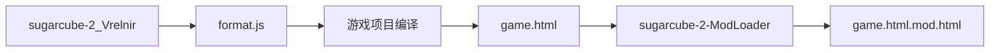

# CI/CD 构建流水线

ModLoader 生态使用 GitHub Actions 实现自动编译和发布。各仓库的构建产物可直接下载使用，无需本地编译。

## 相关仓库

| 仓库                                                                            | 说明                                        |
| ------------------------------------------------------------------------------- | ------------------------------------------- |
| [sugarcube-2_Vrelnir](https://github.com/Lyoko-Jeremie/sugarcube-2_Vrelnir)     | 修改版 SC2 引擎，已注入 ModLoader 引导点    |
| [sugarcube-2-ModLoader](https://github.com/Lyoko-Jeremie/sugarcube-2-ModLoader) | ModLoader 本体及 Insert Tools               |
| [DoLModLoaderBuild](https://github.com/Lyoko-Jeremie/DoLModLoaderBuild)         | 包含 ModLoader 和预置 Mod 的 DoL 自动构建版 |

## 修改版 SC2 引擎

- **Actions**：[sugarcube-2_Vrelnir/actions](https://github.com/Lyoko-Jeremie/sugarcube-2_Vrelnir/actions)
- **构建产物**：`format.js`（包含 ModLoader 引导点、Wikifier 增强、img/svg 标签拦截）
- **用途**：覆盖游戏项目的 `devTools/tweego/storyFormats/sugarcube-2/format.js`，或通过 sc2ReplaceTool 替换到已编译的 HTML

## ModLoader 及工具

- **Actions**：[sugarcube-2-ModLoader/actions](https://github.com/Lyoko-Jeremie/sugarcube-2-ModLoader/actions)
- **构建产物**：
  - `BeforeSC2.js` — ModLoader 核心
  - `insert2html.js` — HTML 注入工具
  - `packModZip.js` — Mod 打包工具
  - `sc2ReplaceTool.js` — SC2 引擎替换工具
  - 预置 Mod 的 zip 文件（来自 modList.json 中的子模块）
- **用途**：将 ModLoader 注入到游戏 HTML，或打包 Mod

## DoL 自动构建

- **Actions**：[DoLModLoaderBuild/actions](https://github.com/Lyoko-Jeremie/DoLModLoaderBuild/actions)
- **Releases**：[DoLModLoaderBuild/releases](https://github.com/Lyoko-Jeremie/DoLModLoaderBuild/releases)
- **构建产物**：完整的 DoL 游戏 HTML，已集成 ModLoader 和 modList.json 中的预置 Mod
- **用途**：终端用户可直接下载游玩，或作为整合包基础

## 构建顺序

从零构建完整游戏：

DoLModLoaderBuild 仓库通常自动完成上述流程，并发布到 Releases。
