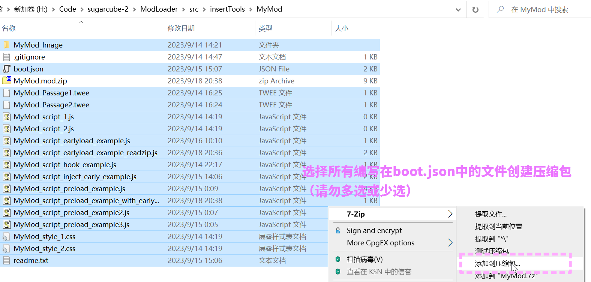
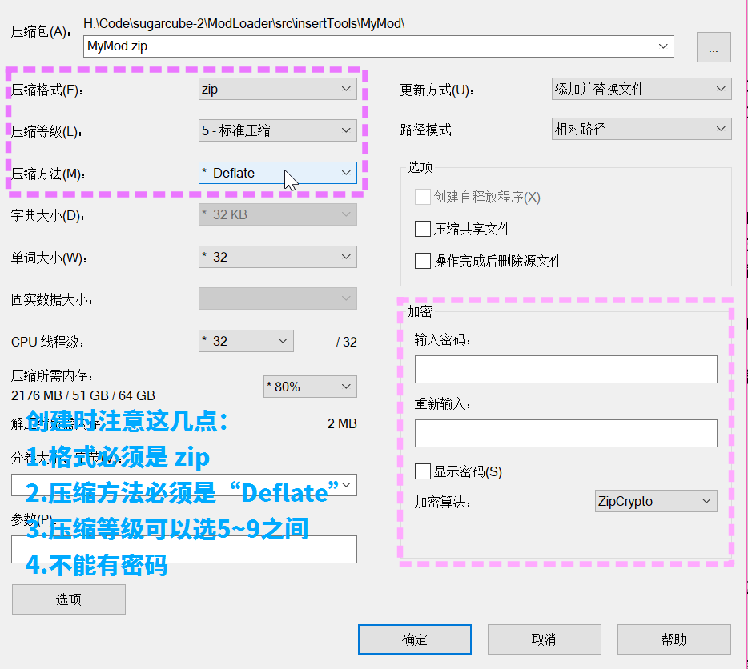
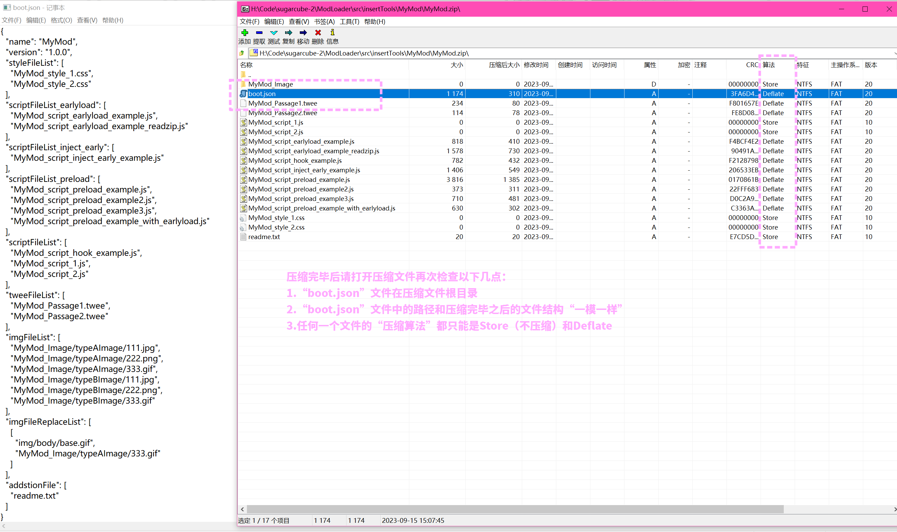

import { Steps } from '@astrojs/starlight/components';

### 手动打包方法

这个方法只需要有一个可以压缩Zip压缩包的压缩工具，和细心的心。

<Steps>

1. 使用你喜爱的编辑器，编辑好boot.json文件
2. 在boot.json文件根目录使用压缩工具（例如如下例子中使用的 [7-Zip](https://github.com/Lyoko-Jeremie/sugarcube-2-ModLoader/blob/master/7-zip.org)，其他软件方法类似），**仔细选择 boot.json 以及在其中引用的文件打包成zip文件**


3. 设置压缩参数（**格式Zip，算法Deflate，压缩等级越大越好，没有密码**）


4. 点击确定，等待压缩完成
5. 压缩后请打开压缩文件再次检查：（**boot.json 文件在根目录**，boot.json中编写的文件路径和压缩完毕之后的结构一模一样，任何一个文件的压缩算法只能是**Store**或**Deflate**）


6. 重命名压缩包为 mod名字.mod.zip （这一步**可选**）
7. 使用Mod管理器加载Mod
</Steps>

### 自动打包方法

这个方法需要有NodeJs和Yarn使用知识

打包：

编译脚本

```shell
yarn run webpack:insertTools
```

切换到 Mod 所在文件夹，（即boot.json所在文件夹）
```shell
cd src/insertTools/MyMod
```

执行

```shell
node "<packModZip.js 文件路径>" "<boot.json 文件路径>"
```

例如：

```shell
node "H:\Code\sugarcube-2\ModLoader\dist-insertTools\packModZip.js" "boot.json"
```

之后会在当前目录下打包生成一个以boot.js文件中的mod名命名的zip文件，例如：

```
MyMod.mod.zip
```
